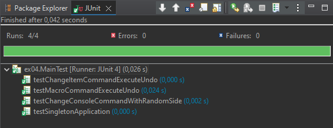
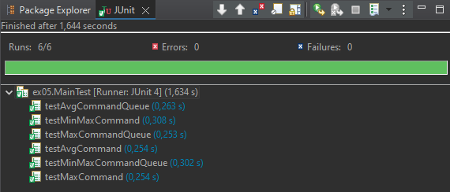

# Завдання 1

### Індивідуальне завдання:
1. Підготувати сховище до розміщення проекту
2. Написати просту консольну програму (наприклад вивід на екран аргументів командної строки)
3. Прикріпити посилання на `GIT` та архівований проект

**CmdArgs.java**
```java
public class CmdArgs {
    public static void main(String[] args) {
        if (args.length == 0) {
            System.out.println("Немає переданих аргументів.");
        } else {
            System.out.println("Передані аргументи:");
            for (int i = 0; i < args.length; i++) {
                System.out.println("Аргумент " + (i + 1) + ": " + args[i]);
            }
        }
    }
}
```


# Завдання 2 - Класи та об'єкти

### Індивідуальне завдання: Обчислення площ геометричних фігур за заданою стороною.

### Структура проекту:

```
pro/
├── src/
│   └── ex01/
│       ├── Calc.java
│       ├── GeometryData.java
│       └── Main.java
├── test/
│   └── ex01/
│       └── MainTest.java
└── README.md
```

`Calc.java`

```java
package ex01;

import java.io.IOException;
import java.io.FileInputStream;
import java.io.FileOutputStream;
import java.io.ObjectInputStream;
import java.io.ObjectOutputStream;

/**
 * Клас для обчислення та збереження площ геометричних фігур.
 */
public class Calc {
    private static final String FNAME = "GeometryData.bin";
    private GeometryData result;

    public Calc() {
        result = new GeometryData();
    }

    public void setResult(GeometryData result) {
        this.result = result;
    }

    public GeometryData getResult() {
        return result;
    }

    /**
     * Обчислює суму площ трикутника та прямокутника за заданою стороною.
     *
     * @param side Довжина сторони в двійковій системі.
     */
    public void init(int side) {
        result.setSideLength(side);
        result.calculateAreas();
    }

    /**
     * Виводить результат обчислень.
     */
    public void show() {
        System.out.println(result);
    }

    /**
     * Зберігає результат у файл.
     *
     * @throws IOException
     */
    public void save() throws IOException {
        ObjectOutputStream os = new ObjectOutputStream(new FileOutputStream(FNAME));
        os.writeObject(result);
        os.flush();
        os.close();
    }

    /**
     * Відновлює результат з файлу.
     *
     * @throws Exception
     */
    public void restore() throws Exception {
        ObjectInputStream is = new ObjectInputStream(new FileInputStream(FNAME));
        result = (GeometryData) is.readObject();
        is.close();
    }
}
```

### Розробив клас, що серіалізується для зберігання параметрів і результатів обчислень:

`GeometryData.java`

```Java
package ex01;

import java.io.Serializable;

/**
 * Клас для зберігання даних про геометричні фігури та результатів обчислень.
 */
public class GeometryData implements Serializable {
    private int sideLength;
    private transient double triangleArea;
    private transient double rectangleArea;
    private static final long serialVersionUID = 1L;

    public GeometryData() {
        this.sideLength = 0;
        this.triangleArea = 0.0;
        this.rectangleArea = 0.0;
    }

    public void setSideLength(int sideLength) {
        this.sideLength = sideLength;
    }

    public int getSideLength() {
        return sideLength;
    }

    public double getTriangleArea() {
        return triangleArea;
    }

    public double getRectangleArea() {
        return rectangleArea;
    }

    /**
     * Обчислює площі трикутника та прямокутника.
     */
    public void calculateAreas() {
        String binarySide = Integer.toBinaryString(sideLength);
        int decimalSide = Integer.parseInt(binarySide, 2);
        this.triangleArea = (Math.sqrt(3) / 4) * decimalSide * decimalSide;
        this.rectangleArea = decimalSide * decimalSide;
    }

    @Override
    public String toString() {
        return "Side Length (binary): " + Integer.toBinaryString(sideLength) +
                ", Triangle Area: " + triangleArea +
                ", Rectangle Area: " + rectangleArea +
                ", Total Area: " + (triangleArea + rectangleArea);
    }

    @Override
    public boolean equals(Object obj) {
        if (this == obj) return true;
        if (obj == null || getClass() != obj.getClass()) return false;
        GeometryData other = (GeometryData) obj;
        return sideLength == other.sideLength &&
                Double.compare(other.triangleArea, triangleArea) == 0 &&
                Double.compare(other.rectangleArea, rectangleArea) == 0;
    }
}
```

### Використовуючи агрегування, розробив клас для знаходження рішення задачі:

`Calc.java`

```Java
package ex01;

import java.io.IOException;
import java.io.FileInputStream;
import java.io.FileOutputStream;
import java.io.ObjectInputStream;
import java.io.ObjectOutputStream;

/**
 * Клас для обчислення та збереження площ геометричних фігур.
 */
public class Calc {
    private static final String FNAME = "GeometryData.bin";
    private GeometryData result;

    public Calc() {
        result = new GeometryData();
    }

    public void setResult(GeometryData result) {
        this.result = result;
    }

    public GeometryData getResult() {
        return result;
    }

    /**
     * Обчислює суму площ трикутника та прямокутника за заданою стороною.
     *
     * @param side Довжина сторони в двійковій системі.
     */
    public void init(int side) {
        result.setSideLength(side);
        result.calculateAreas();
    }

    /**
     * Виводить результат обчислень.
     */
    public void show() {
        System.out.println(result);
    }

    /**
     * Зберігає результат у файл.
     *
     * @throws IOException
     */
    public void save() throws IOException {
        ObjectOutputStream os = new ObjectOutputStream(new FileOutputStream(FNAME));
        os.writeObject(result);
        os.flush();
        os.close();
    }

    /**
     * Відновлює результат з файлу.
     *
     * @throws Exception
     */
    public void restore() throws Exception {
        ObjectInputStream is = new ObjectInputStream(new FileInputStream(FNAME));
        result = (GeometryData) is.readObject();
        is.close();
    }
}
```

### Розробив клас для демонстрації в діалоговому режимі збереження та відновлення стану об'єкта, використовуючи серіалізацію. Показав особливості використання transient полів:

`Main.java`

```Java
package ex01;

import java.io.BufferedReader;
import java.io.IOException;
import java.io.InputStreamReader;

/**
 * Головний клас для взаємодії з користувачем.
 */
public class Main {
    private Calc calc = new Calc();

    private void menu() throws IOException {
        BufferedReader reader = new BufferedReader(new InputStreamReader(System.in));
        String input;

        while (true) {
            System.out.println("Enter command (side length, view, save, restore, exit):");
            input = reader.readLine();

            if (input.equalsIgnoreCase("exit")) {
                break;
            }

            switch (input.toLowerCase()) {
                case "view":
                    calc.show();
                    break;
                case "save":
                    calc.save();
                    System.out.println("Saved.");
                    break;
                case "restore":
                    try {
                        calc.restore();
                        System.out.println("Restored.");
                    } catch (Exception e) {
                        System.out.println("Error restoring: " + e.getMessage());
                    }
                    break;
                default:
                    try {
                        int side = Integer.parseInt(input);
                        calc.init(side);
                        calc.show();
                    } catch (NumberFormatException e) {
                        System.out.println("Invalid command.");
                    }
                    break;
            }
        }
    }

    public static void main(String[] args) throws IOException {
        new Main().menu();
    }
}
```

### Розробив клас для тестування коректності результатів обчислень та серіалізації/десеріалізації:

`MainTest.java`

```Java
package ex01;

import org.junit.Test;
import static org.junit.Assert.*;

/**
 * Клас для тестування функціональності Calc та GeometryData.
 */
public class MainTest {

    @Test
    public void testAreaCalculation() {
        Calc calc = new Calc();
        calc.init(5);
        GeometryData result = calc.getResult();
        assertEquals(10.825, result.getTriangleArea(), 0.001);
        assertEquals(25.0, result.getRectangleArea(), 0.001);
    }

    @Test
    public void testSerialization() {
        Calc calc = new Calc();
        calc.init(5);
        try {
            calc.save();
            calc.restore();
            assertEquals(calc.getResult(), calc.getResult());
        } catch (Exception e) {
            fail("Serialization test failed: " + e.getMessage());
        }
    }
}
```

### Опис роботи:

Цей проект реалізує обчислення площ геометричних фігур (трикутника та прямокутника) за заданою довжиною сторони в двійковій системі, використовуючи класи `Calc` та `GeometryData`. Клас `GeometryData` є серіалізованим та містить `transient` поля для демонстрації особливостей їх використання. Клас `Calc` використовує агрегування `GeometryData` для зберігання та обробки даних. Клас `Main` надає інтерфейс командного рядка для взаємодії з користувачем, включаючи збереження та відновлення стану об'єкта. Клас `MainTest` містить JUnit тести для перевірки коректності обчислень та серіалізації/десеріалізації.

#### Пройдені тести:


# Завдання 3 - Спадкування

1. Як основа використовувати вихідний текст проекту попередньої лабораторної роботи. Забезпечити розміщення результатів обчислень уколекції з можливістю збереження/відновлення.
2. Використовуючи шаблон проектування Factory Method (Virtual Constructor), розробити ієрархію, що передбачає розширення рахунок додавання
нових відображуваних класів.
3. Розширити ієрархію інтерфейсом "фабрикованих" об'єктів, що представляє набір методів для відображення результатів обчислень.
4. Реалізувати ці методи виведення результатів у текстовому виде.
5. Розробити тареалізувати інтерфейс для "фабрикуючого" методу.

### Структура проекту:

```
pro/
├── src/
│   └── ex02/
│       ├── Calc.java
│       ├── GeometryData.java
│       ├── Main.java
│       ├── View.java
│       ├── Viewable.java
│       ├── ViewableResult.java
│       └── ViewResult.java
└── test/
    └── ex02/
        └── MainTest.java
```


`Main.java` Головний клас, забезпечує взаємодію з користувачем через консольне меню.

```Java
package ex02;

import java.io.BufferedReader;
import java.io.IOException;
import java.io.InputStreamReader;

/**
 * Головний клас для взаємодії з користувачем.
 */
public class Main {

    private Calc calc = new Calc();
    private View view;

    /**
     * Конструктор класу Main.
     * Ініціалізує об'єкти Calc та View, використовуючи патерн Factory Method для створення ViewResult.
     */
    public Main() {
        ViewableResult viewableResult = new ViewableResult();
        view = viewableResult.getView();
        ((ViewResult) view).setResult(calc.getResult());
    }

    /**
     * Метод для відображення консольного меню та обробки команд користувача.
     * Забезпечує взаємодію з користувачем в циклі, поки не буде введена команда "exit".
     * @throws IOException Виникає при помилках вводу/виводу.
     */
    protected void menu() throws IOException {
        BufferedReader reader = new BufferedReader(new InputStreamReader(System.in));
        String input;

        while (true) {
            System.out.println("Enter command (side, view, save, restore, exit):");
            input = reader.readLine();

            if (input.equalsIgnoreCase("exit")) {
                break;
            }

            String lowerInput = input.toLowerCase();

            if (lowerInput.startsWith("side")) {
                try {
                    String sideStr = lowerInput.substring(4).trim();
                    int side = Integer.parseInt(sideStr);
                    calc.init(side);
                    ((ViewResult) view).setResult(calc.getResult());
                    view.viewShow();
                } catch (NumberFormatException e) {
                    System.out.println("Invalid side length. Please enter a number after 'side'.");
                } catch (StringIndexOutOfBoundsException e) {
                    System.out.println("Please enter a side length after 'side'.");
                }
            } else {
                switch (lowerInput) {
                    case "view":
                        view.viewShow();
                        break;
                    case "save":
                        calc.save();
                        System.out.println("Saved.");
                        view.viewShow();
                        break;
                    case "restore":
                        try {
                            calc.restore();
                            System.out.println("Restored.");
                            ((ViewResult) view).setResult(calc.getResult());
                            view.viewShow();
                        } catch (Exception e) {
                            System.out.println("Error restoring: " + e.getMessage());
                        }
                        break;
                    default:
                        System.out.println("Invalid command.");
                }
            }
        }
    }

    /**
     * Головний метод програми.
     * Створює екземпляр класу Main та запускає консольне меню для взаємодії з користувачем.
     * @param args Аргументи командної строки (не використовуються).
     * @throws IOException Виникає при помилках вводу/виводу.
     */
    public static void main(String[] args) throws IOException {
        new Main().menu();
    }
}
```

`Viev.java` Product (шаблон проєктування Factory Method), інтерфейс `View`, оголошує методи відображення.

```Java
package ex02;

import java.io.IOException;

/** Product (шаблон проєктування Factory Method).
 * Інтерфейс "фабрикованих" об'єктів.
 * Оголошує методи відображення об'єктів.
 * @author Glerik
 * @version 1.0
 */
public interface View {

    /** Відображає заголовок. */
    void viewHeader();

    /** Відображає основну частину (тіло). */
    void viewBody();

    /** Відображає підвал. */
    void viewFooter();

    /** Відображає об'єкт цілком (заголовок, тіло, підвал). */
    void viewShow();

    /** Виконує ініціалізацію даних для відображення. */
    void viewInit(int side);

    /** Зберігає дані для подальшого відновлення.
     * @throws IOException Виникає при помилках серіалізації.
     */
    void viewSave() throws IOException;

    /** Відновлює раніше збережені дані.
     * @throws Exception Виникає при помилках десеріалізації.
     */
    void viewRestore() throws Exception;
}
```

`Viewable.java` Creator (шаблон проєктування Factory Method), інтерфейс `Viewable`, оголошує "фабрикуючий" метод.

```Java
package ex02;

/** Creator (шаблон проєктування Factory Method).
 * Інтерфейс, що оголошує метод, "фабрикуючий" об'єкти.
 * @author Glerik
 * @version 1.0
 * @see Viewable#getView()
 */
public interface Viewable {

    /** Створює об'єкт, що реалізує {@linkplain View}.
     * @return Об'єкт, що реалізує інтерфейс View.
     */
    View getView();
}
```

`ViewableResult.java` ConcreteCreator (шаблон проєктування Factory Method), клас `ViewableResult`, "фабрикує" об'єкти `ViewResult`.

```Java
package ex02;

/** ConcreteCreator (шаблон проєктування Factory Method).
 * Клас, що "фабрикує" об'єкти {@linkplain ViewResult}.
 * @author Glerik
 * @version 1.0
 * @see Viewable
 * @see ViewableResult#getView()
 */
public class ViewableResult implements Viewable {

    /** Створює відображуваний об'єкт {@linkplain ViewResult}.
     * @return Об'єкт ViewResult.
     */
    @Override
    public View getView() {
        return new ViewResult();
    }
}
```

`ViewResult.java` ConcreteProduct (шаблон проєктування Factory Method), клас `ViewResult`, реалізація інтерфейсу `View` для відображення результатів.

```Java
package ex02;

import java.io.FileInputStream;
import java.io.FileOutputStream;
import java.io.IOException;
import java.io.ObjectInputStream;
import java.io.ObjectOutputStream;

/** ConcreteProduct (Шаблон проєктування Factory Method).
 * Клас для відображення результатів обчислень площ фігур.
 * Зберігає та відображає результати.
 * @author Glerik
 * @version 1.0
 * @see View
 */
public class ViewResult implements View {

    /** Ім'я файлу для серіалізації. */
    private static final String FNAME = "GeometryData.bin";

    /** Об'єкт GeometryData, що містить результати обчислень. */
    private GeometryData result;

    /**
     * Конструктор за замовчуванням.
     * Створює новий об'єкт GeometryData.
     */
    public ViewResult() {
        result = new GeometryData();
    }

    /**
     * Встановлює об'єкт GeometryData для відображення.
     * @param result Об'єкт GeometryData з результатами.
     */
    public void setResult(GeometryData result) {
        this.result = result;
    }

    /**
     * Повертає об'єкт GeometryData.
     * @return Об'єкт GeometryData.
     */
    public GeometryData getResult() {
        return result;
    }

    /**
     * {@inheritDoc}
     */
    @Override
    public void viewHeader() {
        System.out.println("Результати обчислень площ:");
        System.out.println("---------------------------");
    }

    /**
     * {@inheritDoc}
     */
    @Override
    public void viewBody() {
        System.out.println(result); // Використовуємо toString() з GeometryData
    }

    /**
     * {@inheritDoc}
     */
    @Override
    public void viewFooter() {
        System.out.println("---------------------------");
        System.out.println("Кінець виводу.");
    }

    /**
     * {@inheritDoc}
     */
    @Override
    public void viewShow() {
        viewHeader();
        viewBody();
        viewFooter();
    }

    /**
     * {@inheritDoc}
     */
    @Override
    public void viewInit(int side) {
        result.setSideLength(side);
        result.calculateAreas();
    }

    /**
     * {@inheritDoc}
     */
    @Override
    public void viewSave() throws IOException {
        ObjectOutputStream os = new ObjectOutputStream(new FileOutputStream(FNAME));
        os.writeObject(result);
        os.flush();
        os.close();
    }

    /**
     * {@inheritDoc}
     */
    @Override
    public void viewRestore() throws Exception {
        ObjectInputStream is = new ObjectInputStream(new FileInputStream(FNAME));
        result = (GeometryData) is.readObject();
        is.close();
    }
}
```

`MainTest.java` Клас `MainTest`, містить JUnit тести для перевірки функціональності проєкту.

```Java
package ex02;

import org.junit.Test;
import static org.junit.Assert.*;

/**
 * Клас для тестування функціональності Calc та GeometryData, а також ViewResult в пакеті ex02.
 */
public class MainTest {

    @Test
    public void testAreaCalculationAndView() {
        Calc calc = new Calc();
        calc.init(5);

        ViewableResult viewableResult = new ViewableResult();
        ViewResult viewResult = (ViewResult) viewableResult.getView();
        viewResult.setResult(calc.getResult()); // Передаємо результат в ViewResult

        GeometryData result = viewResult.getResult();

        assertEquals(10.825, result.getTriangleArea(), 0.001);
        assertEquals(25.0, result.getRectangleArea(), 0.001);

        // Тут можна додати перевірку виводу viewResult.viewShow(), якщо потрібно протестувати відображення
        // В даному прикладі, тестування виводу може бути складним без перехоплення System.out.
    }

    @Test
    public void testSerializationAndViewRestore() {
        Calc calc1 = new Calc();
        calc1.init(5);

        try {
            calc1.save();

            Calc calc2 = new Calc();
            calc2.restore();

            GeometryData result1 = calc1.getResult();
            GeometryData result2 = calc2.getResult();

            assertEquals(result1, result2); // Перевірка, що об'єкти GeometryData однакові після відновлення

            ViewableResult viewableResult = new ViewableResult();
            ViewResult viewResult = (ViewResult) viewableResult.getView();
            viewResult.setResult(calc2.getResult()); // Передаємо відновлений результат в ViewResult
            viewResult.viewShow(); // Выводимо восстановленный результат через ViewResult (для візуальної перевірки)


        } catch (Exception e) {
            fail("Помилка серіалізації/десеріалізації: " + e.getMessage());
        }
    }
}
```

#### Пройдені тести:


# Завдання 4 - Поліморфізм

Вам потрібно виконати наступне:
1. За основу використовувати вихідний текст проекту попередньої лабораторної роботи Використовуючи шаблон проектування Factory Method (Virtual Constructor), розширити ієрархію похідними класами, реалізують методи для подання результатів у вигляді текстової таблиці. Параметри відображення таблиці мають визначатися користувачем.
2. Продемонструвати заміщення (перевизначення, overriding), поєднання (перевантаження overloading), динамічне призначення методів (Пізнє зв'язування, поліморфізм, dynamic method dispatch).
3. Забезпечити діалоговий інтерфейс із користувачем.
4. Розробити клас для тестування основної функціональності.
5. Використати коментарі для автоматичної генерації документації засобами javadoc.

### Структура проекту:

```
pro/
├── src/
│   ├── ex02/
│   │   ├── Calc.java
│   │   ├── GeometryData.java
│   │   ├── Main.java
│   │   ├── View.java
│   │   ├── Viewable.java
│   │   ├── ViewableResult.java
│   │   └── ViewResult.java
│   └── ex03/
│       ├── Main.java
│       ├── ViewableTable.java
│       └── ViewTable.java
└── test/
    ├── ex02/
    │   └── MainTest.java
    └── ex03/
        └── MainTest.java
```


`ex03/Main.java` Клас Main - розширена версія програми з табличним виводом

```Java
package ex03;

import ex02.Calc;
import ex02.View;
import ex02.ViewResult;
import ex02.ViewableResult;

import java.io.BufferedReader;
import java.io.IOException;
import java.io.InputStreamReader;

/**
 * Головний клас для взаємодії з користувачем, розширений для підтримки табличного виводу.
 * @author Glerik
 * @version 1.1
 * @see Main#main
 */
public class Main extends ex02.Main {

    private View view;
    private Calc calc = new Calc();
    private boolean useTableView = false; // Прапорець для вибору табличного виводу
    private int tableWidth = 30; // Ширина таблиці за замовчуванням

    /**
     * Конструктор класу Main.
     * Ініціалізує об'єкти Calc та View, використовуючи патерн Factory Method.
     * За замовчуванням використовує звичайний вивід {@linkplain ViewResult}.
     */
    public Main() {
        ViewableResult viewableResult = new ViewableResult();
        view = viewableResult.getView();
        ((ViewResult) view).setResult(calc.getResult());
    }

    /**
     * Конструктор для вибору типу View.
     * @param view Об'єкт View, який буде використовуватись для відображення.
     */
    public Main(View view) {
        this.view = view;
        if (view instanceof ViewResult) {
            ((ViewResult) view).setResult(calc.getResult());
        }
    }


    /**
     * Метод для відображення консольного меню та обробки команд користувача.
     * Додано підтримку команд для вибору табличного виводу та встановлення ширини таблиці.
     * @throws IOException Виникає при помилках вводу/виводу.
     */
    @Override
    protected void menu() throws IOException {
        BufferedReader reader = new BufferedReader(new InputStreamReader(System.in));
        String input;

        while (true) {
            System.out.println("\nВведіть команду (side [ширина] <сторона>, view, save, restore, tableview, setwidth <ширина>, exit):");
            input = reader.readLine();

            if (input.equalsIgnoreCase("exit")) {
                break;
            }

            String lowerInput = input.toLowerCase();

            if (lowerInput.startsWith("side")) {
                try {
                    String sideInput = lowerInput.substring(4).trim();
                    int widthInput = tableWidth; // За замовчуванням використовуємо поточну ширину таблиці

                    String[] parts = sideInput.split("\\s+", 2); // Розділяємо ввід на ширину та сторону
                    if (parts.length > 1) {
                        try {
                            widthInput = Integer.parseInt(parts[0]); // Перше слово може бути шириною
                            sideInput = parts[1]; // Друге слово - сторона
                            tableWidth = widthInput; // Оновлюємо поточну ширину таблиці
                            useTableView = true; // Автоматично переходимо в табличний вивід при заданні ширини
                        } catch (NumberFormatException e) {
                            sideInput = parts[0]; // Якщо не вдалося розпарсити ширину, вважаємо перше слово стороною
                        }
                    }


                    int side = Integer.parseInt(sideInput.trim());

                    calc.init(side);

                    if (useTableView) {
                        ViewTable tableView = (ViewTable) new ViewableTable().getView();
                        tableView.setResult(calc.getResult());
                        tableView.viewShow(widthInput); // Використовуємо задану ширину або ширину за замовчуванням
                        view = tableView; // Оновлюємо поточний view для 'view', 'save', 'restore' команд, щоб використовувався табличний вивід
                    } else {
                        ((ViewResult) view).setResult(calc.getResult());
                        view.viewShow();
                    }


                } catch (NumberFormatException e) {
                    System.out.println("Невірна довжина сторони. Будь ласка, введіть число після 'side'.");
                } catch (StringIndexOutOfBoundsException e) {
                    System.out.println("Будь ласка, введіть довжину сторони після 'side'.");
                }
            } else {
                switch (lowerInput) {
                    case "view":
                        if (useTableView) {
                            ((ViewTable) view).viewShow(tableWidth); // Відображення таблиці з поточною шириною
                        } else {
                            view.viewShow();
                        }
                        break;
                    case "save":
                        calc.save();
                        System.out.println("Збережено.");
                        if (useTableView) {
                            ((ViewTable) view).viewShow(tableWidth);
                        } else {
                            view.viewShow();
                        }
                        break;
                    case "restore":
                        try {
                            calc.restore();
                            System.out.println("Відновлено.");
                            if (useTableView) {
                                ((ViewTable) view).setResult(calc.getResult()); // Оновлення результату для табличного виводу
                                ((ViewTable) view).viewShow(tableWidth);
                            } else {
                                ((ViewResult) view).setResult(calc.getResult());
                                view.viewShow();
                            }
                        } catch (Exception e) {
                            System.out.println("Помилка відновлення: " + e.getMessage());
                        }
                        break;
                    case "tableview":
                        useTableView = true;
                        System.out.println("Перехід до табличного виводу.");
                        break;
                    case "setwidth":
                        System.out.println("Введіть ширину таблиці:");
                        String widthStr = reader.readLine();
                        try {
                            tableWidth = Integer.parseInt(widthStr);
                            System.out.println("Ширина таблиці встановлена на " + tableWidth + ".");
                            useTableView = true; // Автоматично переходимо в табличний вивід при заданні ширини
                        } catch (NumberFormatException e) {
                            System.out.println("Невірна ширина таблиці. Будь ласка, введіть число.");
                        }
                        break;
                    default:
                        System.out.println("Невідома команда.");
                }
            }
        }
    }


    /**
     * Головний метод програми.
     * Створює екземпляр класу Main та запускає консольне меню для взаємодії з користувачем.
     * Використовує табличний вивід за замовчуванням.
     * @param args Аргументи командної строки (не використовуються).
     * @throws IOException Виникає при помилках вводу/виводу.
     */
    public static void main(String[] args) throws IOException {
        Main main = new Main(new ViewableTable().getView()); // Використовуємо табличний вивід за замовчуванням
        main.menu();
    }
}
```

`ex03/ViewableTable.java` Клас ViewableTable - ConcreteCreator для табличного виводу

```Java
package ex03;
import ex02.ViewableResult;
import ex02.View;

/** ConcreteCreator (шаблон проєктування Factory Method).
 * Клас, що "фабрикує" об'єкти {@linkplain ViewTable}.
 * @author Glerik
 * @version 1.1
 * @see ViewableResult
 * @see ViewableTable#getView()
 */
public class ViewableTable extends ViewableResult {
    /** Створює відображуваний об'єкт {@linkplain ViewTable}.
     * @return Об'єкт ViewTable.
     */
    @Override
    public View getView() {
        return new ViewTable();
    }
}
```

`ViewTable.java`   Клас ViewTable - ConcreteProduct для табличного виводу

```Java
package ex03;

import ex02.GeometryData;
import ex02.ViewResult;
import java.util.Formatter;
import java.io.IOException;

/** ConcreteProduct (Шаблон проєктування Factory Method).
 * Клас для відображення результатів обчислень площ фігур у вигляді таблиці.
 * Розширює {@linkplain ViewResult}, реалізуючи табличне представлення даних.
 * @author Glerik
 * @version 1.1
 * @see ViewResult
 */
public class ViewTable extends ViewResult {

    /** Ширина таблиці за замовчуванням. */
    private static final int DEFAULT_WIDTH = 30;
    /** Поточна ширина таблиці. */
    private int width;

    /**
     * Конструктор за замовчуванням.
     * Встановлює ширину таблиці за замовчуванням {@linkplain ViewTable#DEFAULT_WIDTH}.
     */
    public ViewTable() {
        this(DEFAULT_WIDTH);
    }

    /**
     * Конструктор з параметром ширини таблиці.
     * @param width Ширина таблиці, яку потрібно встановити.
     */
    public ViewTable(int width) {
        super(); // Виклик конструктора суперкласу ViewResult
        this.width = width;
    }

    /**
     * Встановлює ширину таблиці.
     * @param width Нова ширина таблиці.
     */
    public void setWidth(int width) {
        this.width = width;
    }

    /**
     * Повертає поточну ширину таблиці.
     * @return Ширина таблиці.
     */
    public int getWidth() {
        return width;
    }

    /**
     * Встановлює ширину таблиці до значення за замовчуванням {@linkplain ViewTable#DEFAULT_WIDTH}.
     */
    public void resetWidthToDefault() {
        this.width = DEFAULT_WIDTH;
    }

    /**
     * {@inheritDoc}
     */
    @Override
    public void viewHeader() {
        System.out.println("\nРезультати обчислень площ (Таблиця):");
        printLine();
        Formatter fmt = new Formatter();
        fmt.format("%s%-" + ((width/3) + 2) + "s | %-" + ((width/3) + 2) + "s | %-" + ((width/3) + 2) + "s | %-" + ((width/3) + 2) + "s%n",
                "", "Довжина сторони (бінарна)", "Площа трикутника", "Площа прямокутника", "Загальна площа");
        System.out.print(fmt);
        printLine();
    }

    /**
     * {@inheritDoc}
     */
    @Override
    public void viewBody() {
        GeometryData data = getResult();
        if (data != null) {
            Formatter fmt = new Formatter();
            fmt.format("%s%-" + ((width/3) + 2) + "s | %-" + ((width/3) + 2) + ".3f | %-" + ((width/3) + 2) + ".3f | %-" + ((width/3) + 2) + ".3f%n",
                    "",
                    Integer.toBinaryString(data.getSideLength()),
                    data.getTriangleArea(),
                    data.getRectangleArea(),
                    data.getTotalArea());
            System.out.print(fmt);
        } else {
            System.out.println("Дані для відображення відсутні.");
        }
    }


    /**
     * {@inheritDoc}
     */
    @Override
    public void viewFooter() {
        printLine();
        System.out.println("Кінець таблиці.");
    }

    /**
     * Друкує горизонтальну лінію для розділення частин таблиці.
     */
    private void printLine() {
        for (int i = 0; i < width * 2 + 30; i++) {
            System.out.print("-");
        }
        System.out.println();
    }

    /**
     * {@inheritDoc}
     * Розширена для можливості задання ширини таблиці.
     */
    @Override
    public void viewInit(int side) {
        super.viewInit(side);
    }

    /**
     * Перевантаження методу {@linkplain ViewTable#viewInit(int side)} для встановлення ширини таблиці.
     * @param side Довжина сторони для ініціалізації обчислень.
     * @param width Ширина таблиці для встановлення.
     */
    public void viewInit(int side, int width) {
        this.width = width;
        super.viewInit(side);
    }

    /**
     * Перевантаження методу {@linkplain ViewTable#viewShow()} для використання заданої ширини таблиці.
     * Відображає таблицю з поточною шириною.
     */
    public void viewShow(int width) {
        this.width = width;
        viewShow();
    }


    /**
     * {@inheritDoc}
     */
    @Override
    public void viewSave() throws IOException {
        super.viewSave();
    }

    /**
     * {@inheritDoc}
     */
    @Override
    public void viewRestore() throws Exception {
        super.viewRestore();
    }
}
```

`ex03/MainTest.java`

```Java
package ex03;

import ex02.Calc;
import ex02.GeometryData;
import ex02.ViewableResult;
import ex02.ViewResult;
import org.junit.Test;
import static org.junit.Assert.*;

/**
 * Клас для тестування функціональності Calc, GeometryData та ViewTable в пакеті ex03.
 * Розширено для перевірки табличного виводу та його особливостей.
 * @author Glerik
 * @version 1.1
 */
public class MainTest {

    /**
     * Тестує обчислення площ та табличне відображення результатів.
     * Перевіряє коректність обчислень та базове відображення таблиці.
     */
    @Test
    public void testAreaCalculationAndViewTable() {
        Calc calc = new Calc();
        calc.init(5);

        ViewableTable viewableTable = new ViewableTable();
        ViewTable viewTable = (ViewTable) viewableTable.getView();
        viewTable.setResult(calc.getResult());

        GeometryData result = viewTable.getResult();

        assertEquals(10.825, result.getTriangleArea(), 0.001);
        assertEquals(25.0, result.getRectangleArea(), 0.001);

        
        viewTable.viewShow(40);
        assertEquals(40, viewTable.getWidth());
        viewTable.resetWidthToDefault();
        viewTable.viewShow();
        assertEquals(30, viewTable.getWidth());
    }

    /**
     * Тестує серіалізацію та відновлення даних, використовуючи табличний вивід.
     * Перевіряє, що дані коректно зберігаються та відновлюються при використанні ViewTable.
     */
    @Test
    public void testSerializationAndViewTableRestore() {
        Calc calc1 = new Calc();
        calc1.init(5);

        try {
             calc1.save();

            Calc calc2 = new Calc();
            calc2.restore();

            GeometryData result1 = calc1.getResult();
            GeometryData result2 = calc2.getResult();

            assertEquals(result1, result2); // Перевірка, що об'єкти GeometryData однакові після відновлення

            ViewableTable viewableTable = new ViewableTable();
            ViewTable viewTable = (ViewTable) viewableTable.getView();
            viewTable.setResult(calc2.getResult());
            viewTable.viewShow(); // Виводимо відновлений результат через ViewTable для візуальної перевірки

        } catch (Exception e) {
            fail("Помилка серіалізації/десеріалізації: " + e.getMessage());
        }
    }

    /**
     * Тестує основну функціональність звичайного виводу (без таблиці).
     * Перевіряє, що звичайний вивід ViewResult працює коректно.
     */
    @Test
    public void testAreaCalculationAndPlainView() {
        Calc calc = new Calc();
        calc.init(5);

        ViewableResult viewableResult = new ViewableResult();
        ViewResult viewResult = (ViewResult) viewableResult.getView();
        viewResult.setResult(calc.getResult());

        GeometryData result = viewResult.getResult();

        assertEquals(10.825, result.getTriangleArea(), 0.001);
        assertEquals(25.0, result.getRectangleArea(), 0.001);

        // Перевірка виводу viewResult.viewShow() тут може бути складною без перехоплення System.out.
        // Залишаємо базову перевірку обчислень.
    }

    /**
     * Тестує серіалізацію та відновлення даних для звичайного виводу.
     * Перевіряє, що серіалізація/десеріалізація працює коректно зі звичайним ViewResult.
     */
    @Test
    public void testSerializationAndPlainViewRestore() {
        Calc calc1 = new Calc();
        calc1.init(5);

        try {
            calc1.save();

            Calc calc2 = new Calc();
            calc2.restore();

            GeometryData result1 = calc1.getResult();
            GeometryData result2 = calc2.getResult();

            assertEquals(result1, result2); // Перевірка, що об'єкти GeometryData однакові після відновлення

            ViewableResult viewableResult = new ViewableResult();
            ViewResult viewResult = (ViewResult) viewableResult.getView();
            viewResult.setResult(calc2.getResult());
            viewResult.viewShow(); // Виводимо відновлений результат через ViewResult для візуальної перевірки

        } catch (Exception e) {
            fail("Помилка серіалізації/десеріалізації: " + e.getMessage());
        }
    }
}
```

#### Пройдені тести:


# Завдання 5 - Обробка колекцій

Вам потрібно виконати наступне:
1. Реалізувати можливість скасування (undo) операцій (команд).
2. Продемонструвати поняття "макрокоманда"
3. При розробці програми використовувати шаблон Singletone.
4. Забезпечити діалоговий інтерфейс із користувачем.
5. Розробити клас для тестування функціональності програми.


`Application.java` Клас Singleton для керування застосунком та доступом до Calc

```Java
package ex04;

import ex02.Calc;

/**
 * Клас Application, реалізований як Singleton, керує основними аспектами програми.
 * Забезпечує єдину точку доступу до об'єкту Calc та інших глобальних ресурсів.
 */
public class Application {
    private static Application instance;
    private Calc calc;

    /**
     * Приватний конструктор для забезпечення Singleton.
     * Ініціалізує об'єкт Calc.
     */
    private Application() {
        calc = new Calc();
    }

    /**
     * Метод для отримання єдиного екземпляра Application (Singleton pattern).
     * Якщо екземпляр не існує, створює новий.
     * @return Єдиний екземпляр класу Application.
     */
    public static Application getInstance() {
        if (instance == null) {
            instance = new Application();
        }
        return instance;
    }

    /**
     * Повертає об'єкт Calc, що використовується в Application.
     * @return Об'єкт Calc для виконання обчислень.
     */
    public Calc getCalc() {
        return calc;
    }
}
```

`ChangeConsoleCommand.java` Консольна команда для зміни довжини сторони (розширена версія для консольного меню).

```Java
package ex04;

import ex02.Calc;
import ex03.ViewTable;

/**
 * Консольна команда для зміни довжини сторони.
 */
public class ChangeConsoleCommand implements ConsoleCommand {
    private Calc calc;
    private ViewTable view;
    private ChangeItemCommand lastChangeItemCommand; // **Зберігаємо ChangeItemCommand**

    /**
     * Конструктор ChangeConsoleCommand.
     * @param calc Об'єкт Calc для виконання операцій.
     * @param view Об'єкт ViewTable для відображення результатів у таблиці.
     */
    public ChangeConsoleCommand(Calc calc, ViewTable view) {
        this.calc = calc;
        this.view = view;
    }

    /**
     * Повертає ключ команди для меню.
     */
    @Override
    public String getKey() {
        return "side";
    }

    /**
     * Повертає інформацію про команду для відображення в меню.
     */
    @Override
    public String getInfo() {
        return "Встановити довжину сторони (side <довжина>)";
    }

    /**
     * Виконує команду зміни довжини сторони, запитуючи довжину у користувача (без аргументів в команді).
     */
    @Override
    public void execute() throws Exception {
        System.out.println("Введіть нову довжину сторони:");
        String sideStr = System.console().readLine();
        execute(sideStr);
    }

    /**
     * Перевантажений метод execute для обробки команди з аргументом (довжиною сторони).
     * Виконує команду зміни довжини сторони, використовуючи наданий аргумент.
     * @param sideArg Рядок, що представляє нову довжину сторони.
     * @throws Exception Виникає у разі помилок при виконанні команди.
     */
    public void execute(String sideArg) throws Exception {
        if (sideArg != null && !sideArg.trim().isEmpty()) {
            try {
                int side = Integer.parseInt(sideArg.trim());
                ChangeItemCommand changeItemCommand = new ChangeItemCommand(calc, side);
                lastChangeItemCommand = changeItemCommand;
                changeItemCommand.execute();
                view.setResult(calc.getResult());
                view.viewShow();
            } catch (NumberFormatException e) {
                System.out.println("Невірна довжина сторони: '" + sideArg + "'. Будь ласка, введіть ціле число.");
            }
        } else {
            System.out.println("Будь ласка, введіть довжину сторони після команди 'side'.");
        }
    }


    /**
     * Метод undo для ConsoleCommand, який викликає undo у збереженого ChangeItemCommand.
     */
    @Override
    public void undo() throws Exception {
        if (lastChangeItemCommand != null) { 
            lastChangeItemCommand.undo();
        }
    }
}
```

`ChangeItemCommand.java` Команда для зміни довжини сторони.

```Java
package ex04;

import ex02.Calc;

/**
 * Команда для зміни довжини сторони в об'єкті Calc.
 * Реалізує інтерфейс Command та забезпечує можливість скасування операції зміни сторони.
 */
public class ChangeItemCommand implements Command {
    private Calc calc;
    private int oldSide;
    private int newSide;

    /**
     * Конструктор ChangeItemCommand.
     * @param calc Об'єкт Calc, для якого виконується зміна.
     * @param newSide Нова довжина сторони, яку потрібно встановити.
     */
    public ChangeItemCommand(Calc calc, int newSide) {
        this.calc = calc;
        this.newSide = newSide;
        this.oldSide = calc.getResult().getSideLength();
    }

    /**
     * Виконує команду зміни довжини сторони.
     * Ініціалізує обчислення в Calc з новою довжиною сторони.
     * @throws Exception Виникає у разі помилок при виконанні команди.
     */
    @Override
    public void execute() throws Exception {
        calc.init(newSide);
    }

    /**
     * Скасовує команду зміни довжини сторони.
     * Відновлює попередню довжину сторони, яка була до виконання команди.
     * @throws Exception Виникає у разі помилок при скасуванні команди.
     */
    @Override
    public void undo() throws Exception {
        calc.init(oldSide);
    }
}
```

`Command.java` Інтерфейс для команд.

```Java
package ex04;

/**
 * Інтерфейс Command для реалізації шаблону Command.
 * Оголошує методи для виконання та скасування операцій.
 */
public interface Command {
    /**
     * Метод для виконання команди.
     * @throws Exception Виникає у разі помилок при виконанні команди.
     */
    void execute() throws Exception;

    /**
     * Метод для скасування команди.
     * @throws Exception Виникає у разі помилок при скасуванні команди.
     */
    void undo() throws Exception;
}
```

`ConsoleCommand.java` Інтерфейс для консольних команд

```Java
package ex04;

/**
 * Інтерфейс ConsoleCommand розширює інтерфейс Command для консольних команд.
 * Додає методи для отримання ключа команди та інформації про команду для меню.
 */
public interface ConsoleCommand extends Command {
    /**
     * Повертає ключ команди, який використовується для ідентифікації команди в меню.
     * @return Ключ команди (наприклад, "side", "view").
     */
    String getKey();

    /**
     * Повертає інформацію про команду для відображення в меню користувачу.
     * @return Опис команди для меню.
     */
    String getInfo();
}
```

`GenerateConsoleCommand.java`  Консольна команда для генерації випадкової довжини сторони.

```Java
package ex04;

import ex02.Calc;
import ex02.ViewResult;
import java.util.Random;

/**
 * Консольна команда для генерації випадкової довжини сторони.
 * Реалізує ConsoleCommand та генерує випадкову сторону для обчислень.
 * Підтримує скасування операції генерації.
 */
public class GenerateConsoleCommand implements ConsoleCommand {
    private Calc calc;
    private ViewResult view;
    private int oldSide;
    private int newSide;

    /**
     * Конструктор GenerateConsoleCommand.
     * @param calc Об'єкт Calc для виконання операцій.
     * @param view Об'єкт ViewResult для відображення результатів.
     */
    public GenerateConsoleCommand(Calc calc, ViewResult view) {
        this.calc = calc;
        this.view = view;
    }

    /**
     * Повертає ключ команди для меню.
     * @return Ключ команди "generate".
     */
    @Override
    public String getKey() {
        return "generate";
    }

    /**
     * Повертає інформацію про команду для відображення в меню.
     * @return Опис команди "Згенерувати випадкову довжину сторони".
     */
    @Override
    public String getInfo() {
        return "Згенерувати випадкову довжину сторони";
    }

    /**
     * Виконує команду генерації випадкової довжини сторони.
     * Генерує випадкову сторону, ініціалізує обчислення в Calc та відображає результати.
     * @throws Exception Виникає у разі помилок при виконанні команди.
     */
    @Override
    public void execute() throws Exception {
        Random random = new Random();
        newSide = random.nextInt(100) + 1; 
        oldSide = calc.getResult().getSideLength();
        calc.init(newSide);
        view.setResult(calc.getResult());
        view.viewShow();
    }

    /**
     * Скасовує команду генерації випадкової довжини сторони.
     * Відновлює попередню довжину сторони, що була до генерації.
     * @throws Exception Виникає у разі помилок при скасуванні команди.
     */
    @Override
    public void undo() throws Exception {
        calc.init(oldSide);
        view.setResult(calc.getResult());
        view.viewShow();
    }
}
```

`MacroCommand.java` 

```Java
package ex04;

import java.util.List;
import java.util.ArrayList;

/**
 * Клас MacroCommand реалізує макрокоманду, що складається з декількох підкоманд.
 * Дозволяє виконувати послідовність команд як одну операцію та підтримує скасування для всіх підкоманд.
 */
public class MacroCommand implements ConsoleCommand {
    private List<ConsoleCommand> commands = new ArrayList<>();
    private String key;
    private String info;

    /**
     * Конструктор MacroCommand.
     * @param key Ключ макрокоманди для меню.
     * @param info Інформація про макрокоманду для відображення в меню.
     */
    public MacroCommand(String key, String info) {
        this.key = key;
        this.info = info;
    }

    /**
     * Додає підкоманду до макрокоманди.
     * @param cmd ConsoleCommand, яку потрібно додати до макрокоманди.
     */
    public void add(ConsoleCommand cmd) {
        commands.add(cmd);
    }

    /**
     * Повертає ключ макрокоманди для меню.
     * @return Ключ макрокоманди.
     */
    @Override
    public String getKey() {
        return key;
    }

    /**
     * Повертає інформацію про макрокоманду для відображення в меню.
     * @return Опис макрокоманди.
     */
    @Override
    public String getInfo() {
        return info;
    }

    /**
     * Виконує всі підкоманди, що входять до складу макрокоманди, послідовно.
     * @throws Exception Виникає у разі помилок при виконанні будь-якої з підкоманд.
     */
    @Override
    public void execute() throws Exception {
        for (Command cmd : commands) {
            cmd.execute();
        }
    }

    /**
     * Скасовує виконання макрокоманди, скасовуючи підкоманди у зворотному порядку.
     * @throws Exception Виникає у разі помилок при скасуванні будь-якої з підкоманд.
     */
    @Override
    public void undo() throws Exception {
        for (int i = commands.size() - 1; i >= 0; i--) {
            commands.get(i).undo();
        }
    }

    public List<ConsoleCommand> getCommands() {
        return commands;
    }
}
```

`Main.java`

```Java
package ex04;

import ex02.Calc;
import ex02.View;
import ex02.ViewResult;
import ex03.ViewTable;
import ex03.ViewableTable;

import java.io.BufferedReader;
import java.io.IOException;
import java.io.InputStreamReader;

/**
 * Головний клас для взаємодії з користувачем, розширений для підтримки табличного виводу та командної структури.
 * @author Glerik
 * @version 1.3
 * @see Main#main
 */
public class Main extends ex02.Main {

    private View view;
    private Calc calc;
    private Menu menu;

    /**
     * Конструктор класу Main.
     * Ініціалізує об'єкти Calc та View, використовуючи патерн Factory Method.
     * За замовчуванням використовує табличний вивід {@linkplain ViewTable}.
     */
    public Main() {
        Application app = Application.getInstance();
        this.calc = app.getCalc();
        ViewableTable viewableResult = new ViewableTable();
        view = viewableResult.getView();
        ((ViewTable) view).setResult(calc.getResult());

        this.menu = new Menu();
        menu.addCommand(new ChangeConsoleCommand(calc, (ViewTable)view));
        menu.addCommand(new GenerateConsoleCommand(calc, (ViewResult)view));
        menu.addCommand(new SaveConsoleCommand(calc, (ViewResult)view));
        menu.addCommand(new RestoreConsoleCommand(calc, (ViewResult)view));
        menu.addCommand(new ViewConsoleCommand((ViewResult)view));
    }

    /**
     * Конструктор для вибору типу View.
     * @param view Об'єкт View, який буде використовуватись для відображення.
     */
    public Main(View view) {
        Application app = Application.getInstance();
        this.calc = app.getCalc();
        this.view = view;
        if (view instanceof ViewTable) {
            ((ViewTable) view).setResult(calc.getResult());
        } else if (view instanceof ViewResult) {
            ((ViewResult) view).setResult(calc.getResult());
        }
        
        this.menu = new Menu();
        menu.addCommand(new ChangeConsoleCommand(calc, (ViewTable)view)); 
        menu.addCommand(new GenerateConsoleCommand(calc, (ViewResult)view));
        menu.addCommand(new SaveConsoleCommand(calc, (ViewResult)view));
        menu.addCommand(new RestoreConsoleCommand(calc, (ViewResult)view));
        menu.addCommand(new ViewConsoleCommand((ViewResult)view));
    }


    /**
     * Метод для відображення консольного меню та обробки команд користувача.
     * Використовує структуру команд з ex04 та табличний вивід з ex03.
     * @throws IOException Виникає при помилках вводу/виводу.
     */
    @Override
    protected void menu() throws IOException {
        BufferedReader reader = new BufferedReader(new InputStreamReader(System.in));
        String input;


        while (true) {
            menu.showMenu();
            input = reader.readLine();

            if (input.equalsIgnoreCase("exit")) {
                break;
            } else if (input.equalsIgnoreCase("undo")) {
                try {
                    menu.undoLastCommand();
                } catch (Exception e) {
                    System.out.println("Помилка при скасуванні: " + e.getMessage());
                }
            } else {
                try {
                    menu.executeCommand(input);
                } catch (Exception e) {
                    System.out.println("Помилка виконання команди: " + e.getMessage());
                }
            }
        }
    }


    /**
     * Головний метод програми.
     * Створює екземпляр класу Main та запускає консольне меню для взаємодії з користувачем.
     * Використовує табличний вивід за замовчуванням.
     * @param args Аргументи командної строки (не використовуються).
     * @throws IOException Виникає при помилках вводу/виводу.
     */
    public static void main(String[] args) throws IOException {
        Main main = new Main();
        main.menu();
    }
}
```

`Menu.java` Клас, що реалізує консольне меню.

```Java
package ex04;

import java.util.HashMap;
import java.util.Map;
import java.util.Stack;

/**
 * Клас Menu - контейнер для консольних команд.
 * Відповідає за управління командами, їх реєстрацію, виконання та скасування.
 */
public class Menu {
    private Map<String, ConsoleCommand> commands = new HashMap<>();
    private Stack<Command> history = new Stack<>();

    /**
     * Додає команду до меню.
     * @param command ConsoleCommand, яку потрібно додати до меню.
     */
    public void addCommand(ConsoleCommand command) {
        commands.put(command.getKey(), command);
    }

    /**
     * Видаляє команду з меню за її ключем.
     * @param key Ключ команди, яку потрібно видалити.
     */
    public void removeCommand(String key) {
        commands.remove(key);
    }

    /**
     * Виконує команду за заданим ключем.
     * Додає виконану команду до історії для можливості скасування.
     * @param inputLine Рядок вводу користувача, що містить команду та можливі аргументи.
     * @throws Exception Виникає у разі помилок при виконанні команди.
     */
    public void executeCommand(String inputLine) throws Exception {
        String[] parts = inputLine.split(" ", 2);
        String commandKey = parts[0];
        String commandArgument = (parts.length > 1) ? parts[1] : null;

        ConsoleCommand command = commands.get(commandKey);
        if (command != null) {

            if (command instanceof ChangeConsoleCommand) {
                ((ChangeConsoleCommand) command).execute(commandArgument);
            } else {
                command.execute();
            }
            history.push(command);
        } else {
            System.out.println("Невідома команда.");
        }
    }

    /**
     * Скасовує останню виконану команду.
     * Використовує історію команд для виклику методу undo останньої команди.
     * @throws Exception Виникає у разі помилок при скасуванні команди.
     */
    public void undoLastCommand() throws Exception {
        if (!history.isEmpty()) {
            Command lastCommand = history.pop();
            lastCommand.undo();
            System.out.println("Останню команду скасовано.");
        } else {
            System.out.println("Немає команд для скасування.");
        }
    }

    /**
     * Виводить меню команд у консоль.
     * Показує доступні команди та їх описи.
     */
    public void showMenu() {
        System.out.println("\n=== Меню ===");
        for (ConsoleCommand command : commands.values()) {
            System.out.println(command.getKey() + " - " + command.getInfo());
        }
        System.out.println("undo - Скасувати останню операцію");
        System.out.println("exit - Вихід");
        System.out.println("Введіть команду:");
    }

    /**
     * Повертає мапу всіх зареєстрованих команд.
     * @return Map, де ключ - ключ команди, значення - об'єкт ConsoleCommand.
     */
    public Map<String, ConsoleCommand> getCommands() {
        return commands;
    }
}
```

`RestoreConsoleCommand.java` Консольна команда для відновлення збережених результатів.

```Java
package ex04;

import ex02.Calc;
import ex02.ViewResult;
import ex02.GeometryData;

/**
 * Консольна команда для відновлення збережених результатів.
 * Реалізує ConsoleCommand та дозволяє користувачу відновлювати дані з файлу.
 * Підтримує скасування операції відновлення.
 */
public class RestoreConsoleCommand implements ConsoleCommand {
    private Calc calc;
    private ViewResult view;
    private GeometryData previousData;

    /**
     * Конструктор RestoreConsoleCommand.
     * @param calc Об'єкт Calc для виконання операцій.
     * @param view Об'єкт ViewResult для відображення результатів.
     */
    public RestoreConsoleCommand(Calc calc, ViewResult view) {
        this.calc = calc;
        this.view = view;
    }

    /**
     * Повертає ключ команди для меню.
     * @return Ключ команди "restore".
     */
    @Override
    public String getKey() {
        return "restore";
    }

    /**
     * Повертає інформацію про команду для відображення в меню.
     * @return Опис команди "Відновити збережені результати (restore)".
     */
    @Override
    public String getInfo() {
        return "Відновити збережені результати (restore)";
    }

    /**
     * Виконує команду відновлення збережених результатів.
     * Зберігає поточні дані, відновлює дані з файлу в Calc та відображає результати.
     * @throws Exception Виникає у разі помилок при виконанні команди.
     */
    @Override
    public void execute() throws Exception {
        previousData = calc.getResult();
        calc.restore();
        System.out.println("Відновлено.");
        view.setResult(calc.getResult());
        view.viewShow();
    }

    /**
     * Скасовує команду відновлення збережених результатів.
     * Відновлює дані Calc до стану, який був до виконання команди відновлення.
     * @throws Exception Виникає у разі помилок при скасуванні команди.
     */
    @Override
    public void undo() throws Exception {

        if (previousData != null) {
            calc.setResult(previousData);
            view.setResult(calc.getResult());
            view.viewShow();
            System.out.println("Відновлення скасовано до попереднього стану.");
        } else {
            System.out.println("Неможливо скасувати відновлення, попередній стан невідомий.");
        }
    }
}
```

`SaveConsoleCommand.java` Консольна команда для збереження поточних результатів.

```Java
package ex04;

import ex02.Calc;
import ex02.ViewResult;

/**
 * Консольна команда для збереження поточних результатів обчислень.
 * Реалізує ConsoleCommand та дозволяє користувачу зберігати дані у файл.
 * Скасування для цієї команди не передбачено.
 */
public class SaveConsoleCommand implements ConsoleCommand {
    private Calc calc;
    private ViewResult view;

    /**
     * Конструктор SaveConsoleCommand.
     * @param calc Об'єкт Calc для виконання операцій.
     * @param view Об'єкт ViewResult для відображення результатів.
     */
    public SaveConsoleCommand(Calc calc, ViewResult view) {
        this.calc = calc;
        this.view = view;
    }

    /**
     * Повертає ключ команди для меню.
     * @return Ключ команди "save".
     */
    @Override
    public String getKey() {
        return "save";
    }

    /**
     * Повертає інформацію про команду для відображення в меню.
     * @return Опис команди "Зберегти поточні результати (save)".
     */
    @Override
    public String getInfo() {
        return "Зберегти поточні результати (save)";
    }

    /**
     * Виконує команду збереження результатів.
     * Зберігає поточні результати обчислень Calc у файл та відображає їх.
     * @throws Exception Виникає у разі помилок при виконанні команди.
     */
    @Override
    public void execute() throws Exception {
        calc.save();
        System.out.println("Збережено.");
        view.viewShow();
    }

    /**
     * Скасування операції збереження не передбачено.
     * Виводить повідомлення про відсутність скасування для даної команди.
     * @throws Exception Виникає у разі помилок при скасуванні команди.
     */
    @Override
    public void undo() throws Exception {
        System.out.println("Скасування збереження не передбачено.");
    }
}
```

`ViewConsoleCommand.java` Консольна команда для виведення поточних результатів.

```Java
package ex04;

import ex02.ViewResult;

/**
 * Консольна команда для відображення поточних результатів.
 * Реалізує ConsoleCommand та дозволяє користувачу переглядати поточні обчислення.
 * Скасування для цієї команди не передбачено, оскільки вона не змінює стан програми.
 */
public class ViewConsoleCommand implements ConsoleCommand {
    private ViewResult view;

    /**
     * Конструктор ViewConsoleCommand.
     * @param view Об'єкт ViewResult для відображення результатів.
     */
    public ViewConsoleCommand(ViewResult view) {
        this.view = view;
    }

    /**
     * Повертає ключ команди для меню.
     * @return Ключ команди "view".
     */
    @Override
    public String getKey() {
        return "view";
    }

    /**
     * Повертає інформацію про команду для відображення в меню.
     * @return Опис команди "Показати поточні результати (view)".
     */
    @Override
    public String getInfo() {
        return "Показати поточні результати (view)";
    }

    /**
     * Виконує команду відображення результатів.
     * Показує поточні результати обчислень, використовуючи ViewResult.
     * @throws Exception Виникає у разі помилок при виконанні команди.
     */
    @Override
    public void execute() throws Exception {
        view.viewShow();
    }

    /**
     * Скасування для команди перегляду не передбачено.
     * Виводить повідомлення про відсутність скасування для даної команди.
     * @throws Exception Виникає у разі помилок при скасуванні команди.
     */
    @Override
    public void undo() throws Exception {
        System.out.println("Скасування для перегляду не передбачено.");
    }
}
```

#### Пройдені тести:



# Завдання 6 - Паралельне виконання

Вам потрібно виконати наступне:
1. Продемонструвати можливість паралельної обробки елементів колекції (пошук мінімуму, максимуму, обчислення середнього значення, відбір за критерієм, статистична обробка тощо).
2. Управління чергою завдань (команд) реалізувати за допомогою шаблону Worker Thread.


`AbstractCollectionCommand.java`

```Java
package ex05;

import java.util.Collection;

/**
 * Абстрактний клас AbstractCollectionCommand для команд, що обробляють колекції чисел.
 * Реалізує загальну логіку для всіх команд обробки колекцій.
 * @param <T> Тип елементів у колекції, що розширює Number.
 */
public abstract class AbstractCollectionCommand<T extends Number> implements Command {
    protected Collection<T> collection;
    protected double result;

    /**
     * Конструктор AbstractCollectionCommand.
     * @param collection Колекція чисел для обробки.
     */
    public AbstractCollectionCommand(Collection<T> collection) {
        this.collection = collection;
        this.result = 0;
    }

    /**
     * Отримати результат виконання команди.
     * @return Результат обробки колекції.
     */
    public double getResult() {
        return result;
    }

    /**
     * Абстрактний метод для виконання специфічної логіки обробки колекції.
     * Реалізується у підкласах для конкретних операцій (Max, Avg, MinMax).
     * @throws InterruptedException якщо виконання команди перервано.
     */
    @Override
    public abstract void execute() throws InterruptedException;
}
```

`AvgCommand.java`

```Java
package ex05;

import java.util.Collection;
import java.util.concurrent.CountDownLatch;

/**
 * Клас AvgCommand для обчислення середнього значення в колекції чисел.
 */
public class AvgCommand<T extends Number>  extends AbstractCollectionCommand<T> {

    private CountDownLatch latch;

    /**
     * Конструктор AvgCommand.
     * @param collection Колекція чисел для обробки.
     */
    public AvgCommand(Collection<T> collection, CountDownLatch latch) {
        super(collection);
        this.latch = latch;
    }

    /**
     * Обчислює середнє значення в колекції.
     * @throws InterruptedException якщо виконання команди перервано.
     */
    @Override
    public void execute() throws InterruptedException {
        if (collection == null || collection.isEmpty()) {
            result = Double.NaN;
            latch.countDown();
            return;
        }

        double sum = 0;
        for (Number number : collection) {
            sum += number.doubleValue();
            Thread.sleep(50);
        }
        result = sum / collection.size();
        System.out.println("AvgCommand: Середнє значення обчислено = " + result +
                " в потоці " + Thread.currentThread().getName());
        latch.countDown();
    }
}
```

`Command.java`

```Java
package ex05;

/**
 * Інтерфейс Command для представлення завдань, що виконуються в черзі.
 */
public interface Command {
    /**
     * Виконує команду.
     * @throws InterruptedException якщо виконання команди перервано.
     */
    void execute() throws InterruptedException;
}
```

`CommandQueue.java`

```Java
package ex05;

import java.util.concurrent.BlockingQueue;
import java.util.concurrent.LinkedBlockingQueue;

/**
 * Клас CommandQueue реалізує чергу команд та керує Worker Thread.
 */
public class CommandQueue implements Queue {
    private BlockingQueue<Command> queue = new LinkedBlockingQueue<>();
    private Thread workerThread;
    private volatile boolean isRunning = true;

    /**
     * Внутрішній клас Worker, що виконує команди з черги в окремому потоці.
     */
    private class Worker extends Thread {
        @Override
        public void run() {
            while (isRunning || !queue.isEmpty()) {
                try {
                    Command command = take();
                    System.out.println("Worker Thread: Виконую команду " + command.getClass().getSimpleName() +
                            " в потоці " + Thread.currentThread().getName());
                    command.execute();
                } catch (InterruptedException e) {
                    Thread.currentThread().interrupt();
                    break;
                }
            }
            System.out.println("Worker Thread: Завершення роботи " + Thread.currentThread().getName());
        }
    }


    /**
     * Конструктор CommandQueue.
     * Запускає Worker Thread при створенні черги.
     */
    public CommandQueue() {
        Worker worker = new Worker();
        workerThread = worker;
        workerThread.start();
    }

    /**
     * Додає команду до черги.
     * @param command Команда для додавання.
     */
    @Override
    public void put(Command command) {
        try {
            queue.put(command);
        } catch (InterruptedException e) {
            Thread.currentThread().interrupt();
        }
    }

    /**
     * Отримує та видаляє команду з черги.
     * @return Видалена команда.
     * @throws InterruptedException якщо очікування команди перервано.
     */
    @Override
    public Command take() throws InterruptedException {
        return queue.take();
    }

    /**
     * Зупиняє Worker Thread.
     * Встановлює флаг isRunning в false і перериває потік обробника.
     */
    public void stopQueue() {
        isRunning = false;
        workerThread.interrupt();
    }

    /**
     * Очікує завершення роботи Worker Thread.
     * @throws InterruptedException якщо очікування перервано.
     */
    public void join() throws InterruptedException {
        workerThread.join();
    }
}
```

`ConsoleCommand.java`

```Java
package ex05;

/**
 * Інтерфейс ConsoleCommand розширює інтерфейс Command для консольних команд.
 * Додає методи для отримання ключа команди та інформації про команду для меню.
 */
public interface ConsoleCommand extends Command {
    /**
     * Повертає ключ команди, який використовується для ідентифікації команди в меню.
     * @return Ключ команди (наприклад, "execute").
     */
    String getKey();

    /**
     * Повертає інформацію про команду для відображення в меню користувачу.
     * @return Опис команди для меню.
     */
    String getInfo();

    /**
     * Скасування команди.
     * @throws Exception Виникає у разі помилок при скасуванні команди.
     */
    void undo() throws Exception;
}
```

`ExecuteConsoleCommand.java`

```Java
package ex05;

import java.util.List;
import java.util.Random;
import java.util.ArrayList;
import java.util.concurrent.CountDownLatch; // Імпортуємо CountDownLatch

/**
 * Клас ExecuteConsoleCommand реалізує консольну команду для виконання обробки колекції в паралельних потоках.
 */
public class ExecuteConsoleCommand implements ConsoleCommand {
    private CommandQueue queue;

    /**
     * Конструктор ExecuteConsoleCommand.
     * @param queue Черга команд, в яку будуть додаватися завдання.
     */
    public ExecuteConsoleCommand(CommandQueue queue) {
        this.queue = queue;
    }

    /**
     * Повертає ключ команди для меню.
     * @return Ключ команди "execute".
     */
    @Override
    public String getKey() {
        return "execute";
    }

    /**
     * Повертає інформацію про команду для відображення в меню.
     * @return Опис команди "Виконати обробку колекції в паралельних потоках (execute)".
     */
    @Override
    public String getInfo() {
        return "Виконати обробку колекції в паралельних потоках (execute)";
    }

    /**
     * Виконує команду: створює колекцію чисел, додає команди обробки в чергу та очікує завершення обробки.
     * @throws InterruptedException Виникає у разі помилок при виконанні команди.
     */
    @Override
    public void execute() throws InterruptedException {
        List<Integer> numbers = generateRandomNumbers(20); // Випадкова колекція чисел

        CountDownLatch latch = new CountDownLatch(3);

        MaxCommand<Integer> maxCommand = new MaxCommand<>(numbers, latch);
        AvgCommand<Integer> avgCommand = new AvgCommand<>(numbers, latch);
        MinMaxCommand<Integer> minMaxCommand = new MinMaxCommand<>(numbers, latch);

        queue.put(maxCommand);
        queue.put(avgCommand);
        queue.put(minMaxCommand);

        System.out.println("Основний потік: Додано команди до черги.");

        latch.await();

        System.out.println("\nРезультати обробки:");
        System.out.println("MaxCommand Result: " + maxCommand.getResult());
        System.out.println("AvgCommand Result: " + avgCommand.getResult());
        System.out.println("MinMaxCommand Min Positive: " + minMaxCommand.getMinPositive() +
                ", Max Negative: " + minMaxCommand.getMaxNegative());
    }


    /**
     * Скасування команди не передбачено.
     * Виводить повідомлення про відсутність скасування для даної команди.
     * @throws Exception Виникає у разі помилок при скасуванні команди.
     */
    @Override
    public void undo() throws Exception {
        System.out.println("Скасування для команди 'execute' не передбачено.");
    }

    /**
     * Генерує список випадкових цілих чисел.
     * @param count Кількість чисел для генерації.
     * @return Список випадкових цілих чисел.
     */
    private List<Integer> generateRandomNumbers(int count) {
        List<Integer> numbers = new ArrayList<>();
        Random random = new Random();
        for (int i = 0; i < count; i++) {
            numbers.add(random.nextInt(200) - 100); // Числа від -100 до 99
        }
        return numbers;
    }
}
```

`Main.java`

```Java
package ex05;

/**
 * Головний клас програми, що запускає консольний інтерфейс та паралельну обробку колекції.
 */
public class Main {

    /**
     * Головний метод програми.
     * Створює чергу команд, меню та запускає діалоговий інтерфейс з користувачем.
     * @param args Аргументи командного рядка (не використовуються).
     */
    public static void main(String[] args) {
        CommandQueue queue = new CommandQueue();
        Menu menu = new Menu();

        try {
            menu.runMenu(queue);
        } catch (Exception e) {
            System.err.println("Виникла помилка під час роботи програми: " + e.getMessage());
            e.printStackTrace();
        } finally {
            queue.stopQueue();
            try {
                queue.join();
            } catch (InterruptedException e) {
                System.err.println("Переривання під час очікування завершення Worker Thread: " + e.getMessage());
                Thread.currentThread().interrupt();
            }
        }
    }
}
```

`MaxCommand.java`

```Java
package ex05;

import java.util.Collection;
import java.util.concurrent.CountDownLatch;

/**
 * Клас MaxCommand для знаходження максимального значення в колекції чисел.
 */
public class MaxCommand<T extends Number> extends AbstractCollectionCommand<T> {

    private CountDownLatch latch;

    /**
     * Конструктор MaxCommand.
     * @param collection Колекція чисел для обробки.
     */
    public MaxCommand(Collection<T> collection, CountDownLatch latch) {
        super(collection);
        this.latch = latch;
    }

    /**
     * Знаходить максимальне значення в колекції.
     * @throws InterruptedException якщо виконання команди перервано.
     */
    @Override
    public void execute() throws InterruptedException {
        if (collection == null || collection.isEmpty()) {
            result = Double.NaN;
            latch.countDown();
            return;
        }

        double max = Double.NEGATIVE_INFINITY;
        for (Number number : collection) {
            if (number.doubleValue() > max) {
                max = number.doubleValue();
            }
            Thread.sleep(50);
        }
        result = max;
        System.out.println("MaxCommand: Максимальне значення знайдено = " + result +
                " в потоці " + Thread.currentThread().getName());
        latch.countDown();
    }
}
```

`Menu.java`

```Java
package ex05;

import java.util.HashMap;
import java.util.Map;
import java.util.Scanner;

/**
 * Клас Menu - контейнер для консольних команд.
 * Відповідає за управління командами, їх реєстрацію та виконання через консольний інтерфейс.
 */
public class Menu {
    private Map<String, ConsoleCommand> commands = new HashMap<>();

    /**
     * Додає команду до меню.
     * @param command ConsoleCommand, яку потрібно додати до меню.
     */
    public void addCommand(ConsoleCommand command) {
        commands.put(command.getKey(), command);
    }

    /**
     * Видаляє команду з меню за її ключем.
     * @param key Ключ команди, яку потрібно видалити.
     */
    public void removeCommand(String key) {
        commands.remove(key);
    }

    /**
     * Виконує команду за заданим ключем.
     * @param commandKey Ключ команди, яку потрібно виконати.
     * @throws Exception Виникає у разі помилок при виконанні команди.
     */
    public void executeCommand(String commandKey) throws Exception {
        ConsoleCommand command = commands.get(commandKey);
        if (command != null) {
            command.execute();
        } else {
            System.out.println("Невідома команда.");
        }
    }

    /**
     * Виводить меню команд у консоль.
     * Показує доступні команди та їх описи.
     */
    public void showMenu() {
        System.out.println("\n=== Меню ===");
        for (ConsoleCommand command : commands.values()) {
            System.out.println(command.getKey() + " - " + command.getInfo());
        }
        System.out.println("exit - Вихід");
        System.out.println("Введіть команду:");
    }

    /**
     * Запускає діалоговий інтерфейс з користувачем, обробляючи введені команди.
     * @param queue Черга команд для виконання.
     * @throws Exception Виникає у разі помилок вводу/виводу або виконання команд.
     */
    public void runMenu(CommandQueue queue) throws Exception {
        Scanner scanner = new Scanner(System.in);
        String input;

        addCommand(new ExecuteConsoleCommand(queue));

        while (true) {
            showMenu();
            input = scanner.nextLine();

            if (input.equalsIgnoreCase("exit")) {
                System.out.println("Завершення програми.");
                break;
            } else {
                try {
                    executeCommand(input);
                } catch (Exception e) {
                    System.out.println("Помилка виконання команди: " + e.getMessage());
                }
            }
        }
        scanner.close();
    }
}
```

`MinMaxCommand.java`

```Java
package ex05;

import java.util.Collection;
import java.util.concurrent.CountDownLatch;

/**
 * Клас MinMaxCommand для пошуку мінімального позитивного та максимального негативного значень в колекції чисел.
 */
public class MinMaxCommand<T extends Number> extends AbstractCollectionCommand<T> {
    private double minPositive;
    private double maxNegative;
    private CountDownLatch latch;

    /**
     * Конструктор MinMaxCommand.
     * @param collection Колекція чисел для обробки.
     */
    public MinMaxCommand(Collection<T> collection, CountDownLatch latch) {
        super(collection);
        this.minPositive = Double.POSITIVE_INFINITY;
        this.maxNegative = Double.NEGATIVE_INFINITY;
        this.latch = latch;
    }

    public double getMinPositive() {
        return minPositive;
    }

    public double getMaxNegative() {
        return maxNegative;
    }

    /**
     * Знаходить мінімальне позитивне та максимальне негативне значення в колекції.
     * @throws InterruptedException якщо виконання команди перервано.
     */
    @Override
    public void execute() throws InterruptedException {
        if (collection == null || collection.isEmpty()) {
            minPositive = Double.NaN;
            maxNegative = Double.NaN;
            latch.countDown();
            return;
        }

        minPositive = Double.POSITIVE_INFINITY;
        maxNegative = Double.NEGATIVE_INFINITY;

        for (Number number : collection) {
            double value = number.doubleValue();
            if (value > 0 && value < minPositive) {
                minPositive = value;
            }
            if (value < 0 && value > maxNegative) {
                maxNegative = value;
            }
            Thread.sleep(50);
        }

        if (minPositive == Double.POSITIVE_INFINITY) {
            minPositive = Double.NaN;
        }
        if (maxNegative == Double.NEGATIVE_INFINITY) {
            maxNegative = Double.NaN;
        }

        System.out.println("MinMaxCommand: Мінімальне позитивне = " + minPositive +
                ", Максимальне негативне = " + maxNegative +
                " в потоці " + Thread.currentThread().getName());
        result = minPositive;
        latch.countDown();
    }
}
```

`Queue.java`

```Java
package ex05;

/**
 * Інтерфейс Queue для черги команд.
 */
public interface Queue {
    /**
     * Додає команду до черги.
     * @param command Команда для додавання.
     */
    void put(Command command);

    /**
     * Отримує та видаляє команду з черги.
     * @return Видалена команда.
     * @throws InterruptedException якщо очікування команди перервано.
     */
    Command take() throws InterruptedException;
}
```

`MainTest.java`

```Java
package ex05;

import org.junit.Test;
import static org.junit.Assert.*;

import java.util.Arrays;
import java.util.List;
import java.util.concurrent.CountDownLatch;

/**
 * Клас MainTest для тестування функціональності класів CommandQueue, MaxCommand, AvgCommand, MinMaxCommand.
 */
public class MainTest {

    @Test
    public void testMaxCommand() throws InterruptedException {
        List<Integer> numbers = Arrays.asList(1, 5, 2, 8, 3);
        CountDownLatch latch = new CountDownLatch(1);
        MaxCommand<Integer> maxCommand = new MaxCommand<>(numbers, latch);
        maxCommand.execute();
        latch.await();
        assertEquals(8.0, maxCommand.getResult(), 0.001);
    }

    @Test
    public void testAvgCommand() throws InterruptedException {
        List<Integer> numbers = Arrays.asList(1, 2, 3, 4, 5);
        CountDownLatch latch = new CountDownLatch(1);
        AvgCommand<Integer> avgCommand = new AvgCommand<>(numbers, latch);
        avgCommand.execute();
        latch.await();
        assertEquals(3.0, avgCommand.getResult(), 0.001);
    }

    @Test
    public void testMinMaxCommand() throws InterruptedException {
        List<Integer> numbers = Arrays.asList(-5, 1, -2, 8, 3, -10);
        CountDownLatch latch = new CountDownLatch(1);
        MinMaxCommand<Integer> minMaxCommand = new MinMaxCommand<>(numbers, latch);
        minMaxCommand.execute();
        latch.await();
        assertEquals(1.0, minMaxCommand.getMinPositive(), 0.001);
        assertEquals(-2.0, minMaxCommand.getMaxNegative(), 0.001);
    }

    @Test
    public void testMaxCommandQueue() throws InterruptedException {
        CommandQueue queue = new CommandQueue();
        List<Integer> numbers = Arrays.asList(1, 5, 2, 8, 3);
        CountDownLatch latch = new CountDownLatch(1);
        MaxCommand<Integer> maxCommand = new MaxCommand<>(numbers, latch);
        queue.put(maxCommand);
        latch.await();
        queue.stopQueue();
        queue.join();
        assertEquals(8.0, maxCommand.getResult(), 0.001);
    }

    @Test
    public void testAvgCommandQueue() throws InterruptedException {
        CommandQueue queue = new CommandQueue();
        List<Integer> numbers = Arrays.asList(2, 4, 6, 8, 10);
        CountDownLatch latch = new CountDownLatch(1);
        AvgCommand<Integer> avgCommand = new AvgCommand<>(numbers, latch);
        queue.put(avgCommand);
        latch.await();
        queue.stopQueue();
        queue.join();
        assertEquals(6.0, avgCommand.getResult(), 0.001);
    }

    @Test
    public void testMinMaxCommandQueue() throws InterruptedException {
        CommandQueue queue = new CommandQueue();
        List<Integer> numbers = Arrays.asList(-7, 2, -3, 9, 4, -12);
        CountDownLatch latch = new CountDownLatch(1);
        MinMaxCommand<Integer> minMaxCommand = new MinMaxCommand<>(numbers, latch);
        queue.put(minMaxCommand);
        latch.await();
        queue.stopQueue();
        queue.join();
        assertEquals(2.0, minMaxCommand.getMinPositive(), 0.001);
        assertEquals(-3.0, minMaxCommand.getMaxNegative(), 0.001);
    }
}
```

#### Пройдені тести:
