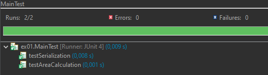
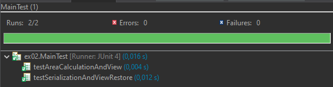
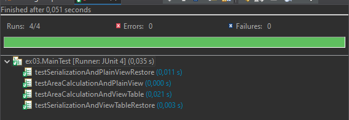

# Завдання 1

### Індивідуальне завдання:
1. Підготувати сховище до розміщення проекту
2. Написати просту консольну програму (наприклад вивід на екран аргументів командної строки)
3. Прикріпити посилання на `GIT` та архівований проект

**CmdArgs.java**
```java
public class CmdArgs {
    public static void main(String[] args) {
        if (args.length == 0) {
            System.out.println("Немає переданих аргументів.");
        } else {
            System.out.println("Передані аргументи:");
            for (int i = 0; i < args.length; i++) {
                System.out.println("Аргумент " + (i + 1) + ": " + args[i]);
            }
        }
    }
}
```


# Завдання 2 - Класи та об'єкти

### Індивідуальне завдання: Обчислення площ геометричних фігур за заданою стороною.

### Структура проекту:

```
pro/
├── src/
│   └── ex01/
│       ├── Calc.java
│       ├── GeometryData.java
│       └── Main.java
├── test/
│   └── ex01/
│       └── MainTest.java
└── README.md
```

`Calc.java`

```java
package ex01;

import java.io.IOException;
import java.io.FileInputStream;
import java.io.FileOutputStream;
import java.io.ObjectInputStream;
import java.io.ObjectOutputStream;

/**
 * Клас для обчислення та збереження площ геометричних фігур.
 */
public class Calc {
    private static final String FNAME = "GeometryData.bin";
    private GeometryData result;

    public Calc() {
        result = new GeometryData();
    }

    public void setResult(GeometryData result) {
        this.result = result;
    }

    public GeometryData getResult() {
        return result;
    }

    /**
     * Обчислює суму площ трикутника та прямокутника за заданою стороною.
     *
     * @param side Довжина сторони в двійковій системі.
     */
    public void init(int side) {
        result.setSideLength(side);
        result.calculateAreas();
    }

    /**
     * Виводить результат обчислень.
     */
    public void show() {
        System.out.println(result);
    }

    /**
     * Зберігає результат у файл.
     *
     * @throws IOException
     */
    public void save() throws IOException {
        ObjectOutputStream os = new ObjectOutputStream(new FileOutputStream(FNAME));
        os.writeObject(result);
        os.flush();
        os.close();
    }

    /**
     * Відновлює результат з файлу.
     *
     * @throws Exception
     */
    public void restore() throws Exception {
        ObjectInputStream is = new ObjectInputStream(new FileInputStream(FNAME));
        result = (GeometryData) is.readObject();
        is.close();
    }
}
```

### Розробив клас, що серіалізується для зберігання параметрів і результатів обчислень:

`GeometryData.java`

```Java
package ex01;

import java.io.Serializable;

/**
 * Клас для зберігання даних про геометричні фігури та результатів обчислень.
 */
public class GeometryData implements Serializable {
    private int sideLength;
    private transient double triangleArea;
    private transient double rectangleArea;
    private static final long serialVersionUID = 1L;

    public GeometryData() {
        this.sideLength = 0;
        this.triangleArea = 0.0;
        this.rectangleArea = 0.0;
    }

    public void setSideLength(int sideLength) {
        this.sideLength = sideLength;
    }

    public int getSideLength() {
        return sideLength;
    }

    public double getTriangleArea() {
        return triangleArea;
    }

    public double getRectangleArea() {
        return rectangleArea;
    }

    /**
     * Обчислює площі трикутника та прямокутника.
     */
    public void calculateAreas() {
        String binarySide = Integer.toBinaryString(sideLength);
        int decimalSide = Integer.parseInt(binarySide, 2);
        this.triangleArea = (Math.sqrt(3) / 4) * decimalSide * decimalSide;
        this.rectangleArea = decimalSide * decimalSide;
    }

    @Override
    public String toString() {
        return "Side Length (binary): " + Integer.toBinaryString(sideLength) +
                ", Triangle Area: " + triangleArea +
                ", Rectangle Area: " + rectangleArea +
                ", Total Area: " + (triangleArea + rectangleArea);
    }

    @Override
    public boolean equals(Object obj) {
        if (this == obj) return true;
        if (obj == null || getClass() != obj.getClass()) return false;
        GeometryData other = (GeometryData) obj;
        return sideLength == other.sideLength &&
                Double.compare(other.triangleArea, triangleArea) == 0 &&
                Double.compare(other.rectangleArea, rectangleArea) == 0;
    }
}
```

### Використовуючи агрегування, розробив клас для знаходження рішення задачі:

`Calc.java`

```Java
package ex01;

import java.io.IOException;
import java.io.FileInputStream;
import java.io.FileOutputStream;
import java.io.ObjectInputStream;
import java.io.ObjectOutputStream;

/**
 * Клас для обчислення та збереження площ геометричних фігур.
 */
public class Calc {
    private static final String FNAME = "GeometryData.bin";
    private GeometryData result;

    public Calc() {
        result = new GeometryData();
    }

    public void setResult(GeometryData result) {
        this.result = result;
    }

    public GeometryData getResult() {
        return result;
    }

    /**
     * Обчислює суму площ трикутника та прямокутника за заданою стороною.
     *
     * @param side Довжина сторони в двійковій системі.
     */
    public void init(int side) {
        result.setSideLength(side);
        result.calculateAreas();
    }

    /**
     * Виводить результат обчислень.
     */
    public void show() {
        System.out.println(result);
    }

    /**
     * Зберігає результат у файл.
     *
     * @throws IOException
     */
    public void save() throws IOException {
        ObjectOutputStream os = new ObjectOutputStream(new FileOutputStream(FNAME));
        os.writeObject(result);
        os.flush();
        os.close();
    }

    /**
     * Відновлює результат з файлу.
     *
     * @throws Exception
     */
    public void restore() throws Exception {
        ObjectInputStream is = new ObjectInputStream(new FileInputStream(FNAME));
        result = (GeometryData) is.readObject();
        is.close();
    }
}
```

### Розробив клас для демонстрації в діалоговому режимі збереження та відновлення стану об'єкта, використовуючи серіалізацію. Показав особливості використання transient полів:

`Main.java`

```Java
package ex01;

import java.io.BufferedReader;
import java.io.IOException;
import java.io.InputStreamReader;

/**
 * Головний клас для взаємодії з користувачем.
 */
public class Main {
    private Calc calc = new Calc();

    private void menu() throws IOException {
        BufferedReader reader = new BufferedReader(new InputStreamReader(System.in));
        String input;

        while (true) {
            System.out.println("Enter command (side length, view, save, restore, exit):");
            input = reader.readLine();

            if (input.equalsIgnoreCase("exit")) {
                break;
            }

            switch (input.toLowerCase()) {
                case "view":
                    calc.show();
                    break;
                case "save":
                    calc.save();
                    System.out.println("Saved.");
                    break;
                case "restore":
                    try {
                        calc.restore();
                        System.out.println("Restored.");
                    } catch (Exception e) {
                        System.out.println("Error restoring: " + e.getMessage());
                    }
                    break;
                default:
                    try {
                        int side = Integer.parseInt(input);
                        calc.init(side);
                        calc.show();
                    } catch (NumberFormatException e) {
                        System.out.println("Invalid command.");
                    }
                    break;
            }
        }
    }

    public static void main(String[] args) throws IOException {
        new Main().menu();
    }
}
```

### Розробив клас для тестування коректності результатів обчислень та серіалізації/десеріалізації:

`MainTest.java`

```Java
package ex01;

import org.junit.Test;
import static org.junit.Assert.*;

/**
 * Клас для тестування функціональності Calc та GeometryData.
 */
public class MainTest {

    @Test
    public void testAreaCalculation() {
        Calc calc = new Calc();
        calc.init(5);
        GeometryData result = calc.getResult();
        assertEquals(10.825, result.getTriangleArea(), 0.001);
        assertEquals(25.0, result.getRectangleArea(), 0.001);
    }

    @Test
    public void testSerialization() {
        Calc calc = new Calc();
        calc.init(5);
        try {
            calc.save();
            calc.restore();
            assertEquals(calc.getResult(), calc.getResult());
        } catch (Exception e) {
            fail("Serialization test failed: " + e.getMessage());
        }
    }
}
```

### Опис роботи:

Цей проект реалізує обчислення площ геометричних фігур (трикутника та прямокутника) за заданою довжиною сторони в двійковій системі, використовуючи класи `Calc` та `GeometryData`. Клас `GeometryData` є серіалізованим та містить `transient` поля для демонстрації особливостей їх використання. Клас `Calc` використовує агрегування `GeometryData` для зберігання та обробки даних. Клас `Main` надає інтерфейс командного рядка для взаємодії з користувачем, включаючи збереження та відновлення стану об'єкта. Клас `MainTest` містить JUnit тести для перевірки коректності обчислень та серіалізації/десеріалізації.

#### Пройдені тести:



# Завдання 3 - Спадкування

1. Як основа використовувати вихідний текст проекту попередньої лабораторної роботи. Забезпечити розміщення результатів обчислень уколекції з можливістю збереження/відновлення.
2. Використовуючи шаблон проектування Factory Method (Virtual Constructor), розробити ієрархію, що передбачає розширення рахунок додавання
нових відображуваних класів.
3. Розширити ієрархію інтерфейсом "фабрикованих" об'єктів, що представляє набір методів для відображення результатів обчислень.
4. Реалізувати ці методи виведення результатів у текстовому виде.
5. Розробити тареалізувати інтерфейс для "фабрикуючого" методу.

### Структура проекту:

```
pro/
├── src/
│   └── ex02/
│       ├── Calc.java
│       ├── GeometryData.java
│       ├── Main.java
│       ├── View.java
│       ├── Viewable.java
│       ├── ViewableResult.java
│       └── ViewResult.java
└── test/
    └── ex02/
        └── MainTest.java
```


`Main.java` Головний клас, забезпечує взаємодію з користувачем через консольне меню.

```Java
package ex02;

import java.io.BufferedReader;
import java.io.IOException;
import java.io.InputStreamReader;

/**
 * Головний клас для взаємодії з користувачем.
 */
public class Main {

    private Calc calc = new Calc();
    private View view;

    /**
     * Конструктор класу Main.
     * Ініціалізує об'єкти Calc та View, використовуючи патерн Factory Method для створення ViewResult.
     */
    public Main() {
        ViewableResult viewableResult = new ViewableResult();
        view = viewableResult.getView();
        ((ViewResult) view).setResult(calc.getResult());
    }

    /**
     * Метод для відображення консольного меню та обробки команд користувача.
     * Забезпечує взаємодію з користувачем в циклі, поки не буде введена команда "exit".
     * @throws IOException Виникає при помилках вводу/виводу.
     */
    protected void menu() throws IOException {
        BufferedReader reader = new BufferedReader(new InputStreamReader(System.in));
        String input;

        while (true) {
            System.out.println("Enter command (side, view, save, restore, exit):");
            input = reader.readLine();

            if (input.equalsIgnoreCase("exit")) {
                break;
            }

            String lowerInput = input.toLowerCase();

            if (lowerInput.startsWith("side")) {
                try {
                    String sideStr = lowerInput.substring(4).trim();
                    int side = Integer.parseInt(sideStr);
                    calc.init(side);
                    ((ViewResult) view).setResult(calc.getResult());
                    view.viewShow();
                } catch (NumberFormatException e) {
                    System.out.println("Invalid side length. Please enter a number after 'side'.");
                } catch (StringIndexOutOfBoundsException e) {
                    System.out.println("Please enter a side length after 'side'.");
                }
            } else {
                switch (lowerInput) {
                    case "view":
                        view.viewShow();
                        break;
                    case "save":
                        calc.save();
                        System.out.println("Saved.");
                        view.viewShow();
                        break;
                    case "restore":
                        try {
                            calc.restore();
                            System.out.println("Restored.");
                            ((ViewResult) view).setResult(calc.getResult());
                            view.viewShow();
                        } catch (Exception e) {
                            System.out.println("Error restoring: " + e.getMessage());
                        }
                        break;
                    default:
                        System.out.println("Invalid command.");
                }
            }
        }
    }

    /**
     * Головний метод програми.
     * Створює екземпляр класу Main та запускає консольне меню для взаємодії з користувачем.
     * @param args Аргументи командної строки (не використовуються).
     * @throws IOException Виникає при помилках вводу/виводу.
     */
    public static void main(String[] args) throws IOException {
        new Main().menu();
    }
}
```

`Viev.java` Product (шаблон проєктування Factory Method), інтерфейс `View`, оголошує методи відображення.

```Java
package ex02;

import java.io.IOException;

/** Product (шаблон проєктування Factory Method).
 * Інтерфейс "фабрикованих" об'єктів.
 * Оголошує методи відображення об'єктів.
 * @author Glerik
 * @version 1.0
 */
public interface View {

    /** Відображає заголовок. */
    void viewHeader();

    /** Відображає основну частину (тіло). */
    void viewBody();

    /** Відображає підвал. */
    void viewFooter();

    /** Відображає об'єкт цілком (заголовок, тіло, підвал). */
    void viewShow();

    /** Виконує ініціалізацію даних для відображення. */
    void viewInit(int side);

    /** Зберігає дані для подальшого відновлення.
     * @throws IOException Виникає при помилках серіалізації.
     */
    void viewSave() throws IOException;

    /** Відновлює раніше збережені дані.
     * @throws Exception Виникає при помилках десеріалізації.
     */
    void viewRestore() throws Exception;
}
```

`Viewable.java` Creator (шаблон проєктування Factory Method), інтерфейс `Viewable`, оголошує "фабрикуючий" метод.

```Java
package ex02;

/** Creator (шаблон проєктування Factory Method).
 * Інтерфейс, що оголошує метод, "фабрикуючий" об'єкти.
 * @author Glerik
 * @version 1.0
 * @see Viewable#getView()
 */
public interface Viewable {

    /** Створює об'єкт, що реалізує {@linkplain View}.
     * @return Об'єкт, що реалізує інтерфейс View.
     */
    View getView();
}
```

`ViewableResult.java` ConcreteCreator (шаблон проєктування Factory Method), клас `ViewableResult`, "фабрикує" об'єкти `ViewResult`.

```Java
package ex02;

/** ConcreteCreator (шаблон проєктування Factory Method).
 * Клас, що "фабрикує" об'єкти {@linkplain ViewResult}.
 * @author Glerik
 * @version 1.0
 * @see Viewable
 * @see ViewableResult#getView()
 */
public class ViewableResult implements Viewable {

    /** Створює відображуваний об'єкт {@linkplain ViewResult}.
     * @return Об'єкт ViewResult.
     */
    @Override
    public View getView() {
        return new ViewResult();
    }
}
```

`ViewResult.java` ConcreteProduct (шаблон проєктування Factory Method), клас `ViewResult`, реалізація інтерфейсу `View` для відображення результатів.

```Java
package ex02;

import java.io.FileInputStream;
import java.io.FileOutputStream;
import java.io.IOException;
import java.io.ObjectInputStream;
import java.io.ObjectOutputStream;

/** ConcreteProduct (Шаблон проєктування Factory Method).
 * Клас для відображення результатів обчислень площ фігур.
 * Зберігає та відображає результати.
 * @author Glerik
 * @version 1.0
 * @see View
 */
public class ViewResult implements View {

    /** Ім'я файлу для серіалізації. */
    private static final String FNAME = "GeometryData.bin";

    /** Об'єкт GeometryData, що містить результати обчислень. */
    private GeometryData result;

    /**
     * Конструктор за замовчуванням.
     * Створює новий об'єкт GeometryData.
     */
    public ViewResult() {
        result = new GeometryData();
    }

    /**
     * Встановлює об'єкт GeometryData для відображення.
     * @param result Об'єкт GeometryData з результатами.
     */
    public void setResult(GeometryData result) {
        this.result = result;
    }

    /**
     * Повертає об'єкт GeometryData.
     * @return Об'єкт GeometryData.
     */
    public GeometryData getResult() {
        return result;
    }

    /**
     * {@inheritDoc}
     */
    @Override
    public void viewHeader() {
        System.out.println("Результати обчислень площ:");
        System.out.println("---------------------------");
    }

    /**
     * {@inheritDoc}
     */
    @Override
    public void viewBody() {
        System.out.println(result); // Використовуємо toString() з GeometryData
    }

    /**
     * {@inheritDoc}
     */
    @Override
    public void viewFooter() {
        System.out.println("---------------------------");
        System.out.println("Кінець виводу.");
    }

    /**
     * {@inheritDoc}
     */
    @Override
    public void viewShow() {
        viewHeader();
        viewBody();
        viewFooter();
    }

    /**
     * {@inheritDoc}
     */
    @Override
    public void viewInit(int side) {
        result.setSideLength(side);
        result.calculateAreas();
    }

    /**
     * {@inheritDoc}
     */
    @Override
    public void viewSave() throws IOException {
        ObjectOutputStream os = new ObjectOutputStream(new FileOutputStream(FNAME));
        os.writeObject(result);
        os.flush();
        os.close();
    }

    /**
     * {@inheritDoc}
     */
    @Override
    public void viewRestore() throws Exception {
        ObjectInputStream is = new ObjectInputStream(new FileInputStream(FNAME));
        result = (GeometryData) is.readObject();
        is.close();
    }
}
```

`MainTest.java` Клас `MainTest`, містить JUnit тести для перевірки функціональності проєкту.

```Java
package ex02;

import org.junit.Test;
import static org.junit.Assert.*;

/**
 * Клас для тестування функціональності Calc та GeometryData, а також ViewResult в пакеті ex02.
 */
public class MainTest {

    @Test
    public void testAreaCalculationAndView() {
        Calc calc = new Calc();
        calc.init(5);

        ViewableResult viewableResult = new ViewableResult();
        ViewResult viewResult = (ViewResult) viewableResult.getView();
        viewResult.setResult(calc.getResult()); // Передаємо результат в ViewResult

        GeometryData result = viewResult.getResult();

        assertEquals(10.825, result.getTriangleArea(), 0.001);
        assertEquals(25.0, result.getRectangleArea(), 0.001);

        // Тут можна додати перевірку виводу viewResult.viewShow(), якщо потрібно протестувати відображення
        // В даному прикладі, тестування виводу може бути складним без перехоплення System.out.
    }

    @Test
    public void testSerializationAndViewRestore() {
        Calc calc1 = new Calc();
        calc1.init(5);

        try {
            calc1.save();

            Calc calc2 = new Calc();
            calc2.restore();

            GeometryData result1 = calc1.getResult();
            GeometryData result2 = calc2.getResult();

            assertEquals(result1, result2); // Перевірка, що об'єкти GeometryData однакові після відновлення

            ViewableResult viewableResult = new ViewableResult();
            ViewResult viewResult = (ViewResult) viewableResult.getView();
            viewResult.setResult(calc2.getResult()); // Передаємо відновлений результат в ViewResult
            viewResult.viewShow(); // Выводимо восстановленный результат через ViewResult (для візуальної перевірки)


        } catch (Exception e) {
            fail("Помилка серіалізації/десеріалізації: " + e.getMessage());
        }
    }
}
```

#### Пройдені тести:



# Завдання 4 - Поліморфізм

Вам потрібно виконати наступне:
1. За основу використовувати вихідний текст проекту попередньої лабораторної роботи Використовуючи шаблон проектування Factory Method (Virtual Constructor), розширити ієрархію похідними класами, реалізують методи для подання результатів у вигляді текстової таблиці. Параметри відображення таблиці мають визначатися користувачем.
2. Продемонструвати заміщення (перевизначення, overriding), поєднання (перевантаження overloading), динамічне призначення методів (Пізнє зв'язування, поліморфізм, dynamic method dispatch).
3. Забезпечити діалоговий інтерфейс із користувачем.
4. Розробити клас для тестування основної функціональності.
5. Використати коментарі для автоматичної генерації документації засобами javadoc.

### Структура проекту:

```
pro/
├── src/
│   ├── ex02/
│   │   ├── Calc.java
│   │   ├── GeometryData.java
│   │   ├── Main.java
│   │   ├── View.java
│   │   ├── Viewable.java
│   │   ├── ViewableResult.java
│   │   └── ViewResult.java
│   └── ex03/
│       ├── Main.java
│       ├── ViewableTable.java
│       └── ViewTable.java
└── test/
    ├── ex02/
    │   └── MainTest.java
    └── ex03/
        └── MainTest.java
```


`ex03/Main.java` Клас Main - розширена версія програми з табличним виводом

```Java
package ex03;

import ex02.Calc;
import ex02.View;
import ex02.ViewResult;
import ex02.ViewableResult;

import java.io.BufferedReader;
import java.io.IOException;
import java.io.InputStreamReader;

/**
 * Головний клас для взаємодії з користувачем, розширений для підтримки табличного виводу.
 * @author Glerik
 * @version 1.1
 * @see Main#main
 */
public class Main extends ex02.Main {

    private View view;
    private Calc calc = new Calc();
    private boolean useTableView = false; // Прапорець для вибору табличного виводу
    private int tableWidth = 30; // Ширина таблиці за замовчуванням

    /**
     * Конструктор класу Main.
     * Ініціалізує об'єкти Calc та View, використовуючи патерн Factory Method.
     * За замовчуванням використовує звичайний вивід {@linkplain ViewResult}.
     */
    public Main() {
        ViewableResult viewableResult = new ViewableResult();
        view = viewableResult.getView();
        ((ViewResult) view).setResult(calc.getResult());
    }

    /**
     * Конструктор для вибору типу View.
     * @param view Об'єкт View, який буде використовуватись для відображення.
     */
    public Main(View view) {
        this.view = view;
        if (view instanceof ViewResult) {
            ((ViewResult) view).setResult(calc.getResult());
        }
    }


    /**
     * Метод для відображення консольного меню та обробки команд користувача.
     * Додано підтримку команд для вибору табличного виводу та встановлення ширини таблиці.
     * @throws IOException Виникає при помилках вводу/виводу.
     */
    @Override
    protected void menu() throws IOException {
        BufferedReader reader = new BufferedReader(new InputStreamReader(System.in));
        String input;

        while (true) {
            System.out.println("\nВведіть команду (side [ширина] <сторона>, view, save, restore, tableview, setwidth <ширина>, exit):");
            input = reader.readLine();

            if (input.equalsIgnoreCase("exit")) {
                break;
            }

            String lowerInput = input.toLowerCase();

            if (lowerInput.startsWith("side")) {
                try {
                    String sideInput = lowerInput.substring(4).trim();
                    int widthInput = tableWidth; // За замовчуванням використовуємо поточну ширину таблиці

                    String[] parts = sideInput.split("\\s+", 2); // Розділяємо ввід на ширину та сторону
                    if (parts.length > 1) {
                        try {
                            widthInput = Integer.parseInt(parts[0]); // Перше слово може бути шириною
                            sideInput = parts[1]; // Друге слово - сторона
                            tableWidth = widthInput; // Оновлюємо поточну ширину таблиці
                            useTableView = true; // Автоматично переходимо в табличний вивід при заданні ширини
                        } catch (NumberFormatException e) {
                            sideInput = parts[0]; // Якщо не вдалося розпарсити ширину, вважаємо перше слово стороною
                        }
                    }


                    int side = Integer.parseInt(sideInput.trim());

                    calc.init(side);

                    if (useTableView) {
                        ViewTable tableView = (ViewTable) new ViewableTable().getView();
                        tableView.setResult(calc.getResult());
                        tableView.viewShow(widthInput); // Використовуємо задану ширину або ширину за замовчуванням
                        view = tableView; // Оновлюємо поточний view для 'view', 'save', 'restore' команд, щоб використовувався табличний вивід
                    } else {
                        ((ViewResult) view).setResult(calc.getResult());
                        view.viewShow();
                    }


                } catch (NumberFormatException e) {
                    System.out.println("Невірна довжина сторони. Будь ласка, введіть число після 'side'.");
                } catch (StringIndexOutOfBoundsException e) {
                    System.out.println("Будь ласка, введіть довжину сторони після 'side'.");
                }
            } else {
                switch (lowerInput) {
                    case "view":
                        if (useTableView) {
                            ((ViewTable) view).viewShow(tableWidth); // Відображення таблиці з поточною шириною
                        } else {
                            view.viewShow();
                        }
                        break;
                    case "save":
                        calc.save();
                        System.out.println("Збережено.");
                        if (useTableView) {
                            ((ViewTable) view).viewShow(tableWidth);
                        } else {
                            view.viewShow();
                        }
                        break;
                    case "restore":
                        try {
                            calc.restore();
                            System.out.println("Відновлено.");
                            if (useTableView) {
                                ((ViewTable) view).setResult(calc.getResult()); // Оновлення результату для табличного виводу
                                ((ViewTable) view).viewShow(tableWidth);
                            } else {
                                ((ViewResult) view).setResult(calc.getResult());
                                view.viewShow();
                            }
                        } catch (Exception e) {
                            System.out.println("Помилка відновлення: " + e.getMessage());
                        }
                        break;
                    case "tableview":
                        useTableView = true;
                        System.out.println("Перехід до табличного виводу.");
                        break;
                    case "setwidth":
                        System.out.println("Введіть ширину таблиці:");
                        String widthStr = reader.readLine();
                        try {
                            tableWidth = Integer.parseInt(widthStr);
                            System.out.println("Ширина таблиці встановлена на " + tableWidth + ".");
                            useTableView = true; // Автоматично переходимо в табличний вивід при заданні ширини
                        } catch (NumberFormatException e) {
                            System.out.println("Невірна ширина таблиці. Будь ласка, введіть число.");
                        }
                        break;
                    default:
                        System.out.println("Невідома команда.");
                }
            }
        }
    }


    /**
     * Головний метод програми.
     * Створює екземпляр класу Main та запускає консольне меню для взаємодії з користувачем.
     * Використовує табличний вивід за замовчуванням.
     * @param args Аргументи командної строки (не використовуються).
     * @throws IOException Виникає при помилках вводу/виводу.
     */
    public static void main(String[] args) throws IOException {
        Main main = new Main(new ViewableTable().getView()); // Використовуємо табличний вивід за замовчуванням
        main.menu();
    }
}
```

`ex03/ViewableTable.java` Клас ViewableTable - ConcreteCreator для табличного виводу

```Java
package ex03;
import ex02.ViewableResult;
import ex02.View;

/** ConcreteCreator (шаблон проєктування Factory Method).
 * Клас, що "фабрикує" об'єкти {@linkplain ViewTable}.
 * @author Glerik
 * @version 1.1
 * @see ViewableResult
 * @see ViewableTable#getView()
 */
public class ViewableTable extends ViewableResult {
    /** Створює відображуваний об'єкт {@linkplain ViewTable}.
     * @return Об'єкт ViewTable.
     */
    @Override
    public View getView() {
        return new ViewTable();
    }
}
```

`ViewTable.java`   Клас ViewTable - ConcreteProduct для табличного виводу

```Java
package ex03;

import ex02.GeometryData;
import ex02.ViewResult;
import java.util.Formatter;
import java.io.IOException;

/** ConcreteProduct (Шаблон проєктування Factory Method).
 * Клас для відображення результатів обчислень площ фігур у вигляді таблиці.
 * Розширює {@linkplain ViewResult}, реалізуючи табличне представлення даних.
 * @author Glerik
 * @version 1.1
 * @see ViewResult
 */
public class ViewTable extends ViewResult {

    /** Ширина таблиці за замовчуванням. */
    private static final int DEFAULT_WIDTH = 30;
    /** Поточна ширина таблиці. */
    private int width;

    /**
     * Конструктор за замовчуванням.
     * Встановлює ширину таблиці за замовчуванням {@linkplain ViewTable#DEFAULT_WIDTH}.
     */
    public ViewTable() {
        this(DEFAULT_WIDTH);
    }

    /**
     * Конструктор з параметром ширини таблиці.
     * @param width Ширина таблиці, яку потрібно встановити.
     */
    public ViewTable(int width) {
        super(); // Виклик конструктора суперкласу ViewResult
        this.width = width;
    }

    /**
     * Встановлює ширину таблиці.
     * @param width Нова ширина таблиці.
     */
    public void setWidth(int width) {
        this.width = width;
    }

    /**
     * Повертає поточну ширину таблиці.
     * @return Ширина таблиці.
     */
    public int getWidth() {
        return width;
    }

    /**
     * Встановлює ширину таблиці до значення за замовчуванням {@linkplain ViewTable#DEFAULT_WIDTH}.
     */
    public void resetWidthToDefault() {
        this.width = DEFAULT_WIDTH;
    }

    /**
     * {@inheritDoc}
     */
    @Override
    public void viewHeader() {
        System.out.println("\nРезультати обчислень площ (Таблиця):");
        printLine();
        Formatter fmt = new Formatter();
        fmt.format("%s%-" + ((width/3) + 2) + "s | %-" + ((width/3) + 2) + "s | %-" + ((width/3) + 2) + "s | %-" + ((width/3) + 2) + "s%n",
                "", "Довжина сторони (бінарна)", "Площа трикутника", "Площа прямокутника", "Загальна площа");
        System.out.print(fmt);
        printLine();
    }

    /**
     * {@inheritDoc}
     */
    @Override
    public void viewBody() {
        GeometryData data = getResult();
        if (data != null) {
            Formatter fmt = new Formatter();
            fmt.format("%s%-" + ((width/3) + 2) + "s | %-" + ((width/3) + 2) + ".3f | %-" + ((width/3) + 2) + ".3f | %-" + ((width/3) + 2) + ".3f%n",
                    "",
                    Integer.toBinaryString(data.getSideLength()),
                    data.getTriangleArea(),
                    data.getRectangleArea(),
                    data.getTotalArea());
            System.out.print(fmt);
        } else {
            System.out.println("Дані для відображення відсутні.");
        }
    }


    /**
     * {@inheritDoc}
     */
    @Override
    public void viewFooter() {
        printLine();
        System.out.println("Кінець таблиці.");
    }

    /**
     * Друкує горизонтальну лінію для розділення частин таблиці.
     */
    private void printLine() {
        for (int i = 0; i < width * 2 + 30; i++) {
            System.out.print("-");
        }
        System.out.println();
    }

    /**
     * {@inheritDoc}
     * Розширена для можливості задання ширини таблиці.
     */
    @Override
    public void viewInit(int side) {
        super.viewInit(side);
    }

    /**
     * Перевантаження методу {@linkplain ViewTable#viewInit(int side)} для встановлення ширини таблиці.
     * @param side Довжина сторони для ініціалізації обчислень.
     * @param width Ширина таблиці для встановлення.
     */
    public void viewInit(int side, int width) {
        this.width = width;
        super.viewInit(side);
    }

    /**
     * Перевантаження методу {@linkplain ViewTable#viewShow()} для використання заданої ширини таблиці.
     * Відображає таблицю з поточною шириною.
     */
    public void viewShow(int width) {
        this.width = width;
        viewShow();
    }


    /**
     * {@inheritDoc}
     */
    @Override
    public void viewSave() throws IOException {
        super.viewSave();
    }

    /**
     * {@inheritDoc}
     */
    @Override
    public void viewRestore() throws Exception {
        super.viewRestore();
    }
}
```

`ex03/MainTest.java`

```Java
package ex03;

import ex02.Calc;
import ex02.GeometryData;
import ex02.ViewableResult;
import ex02.ViewResult;
import org.junit.Test;
import static org.junit.Assert.*;

/**
 * Клас для тестування функціональності Calc, GeometryData та ViewTable в пакеті ex03.
 * Розширено для перевірки табличного виводу та його особливостей.
 * @author Glerik
 * @version 1.1
 */
public class MainTest {

    /**
     * Тестує обчислення площ та табличне відображення результатів.
     * Перевіряє коректність обчислень та базове відображення таблиці.
     */
    @Test
    public void testAreaCalculationAndViewTable() {
        Calc calc = new Calc();
        calc.init(5);

        ViewableTable viewableTable = new ViewableTable();
        ViewTable viewTable = (ViewTable) viewableTable.getView();
        viewTable.setResult(calc.getResult());

        GeometryData result = viewTable.getResult();

        assertEquals(10.825, result.getTriangleArea(), 0.001);
        assertEquals(25.0, result.getRectangleArea(), 0.001);

        
        viewTable.viewShow(40);
        assertEquals(40, viewTable.getWidth());
        viewTable.resetWidthToDefault();
        viewTable.viewShow();
        assertEquals(30, viewTable.getWidth());
    }

    /**
     * Тестує серіалізацію та відновлення даних, використовуючи табличний вивід.
     * Перевіряє, що дані коректно зберігаються та відновлюються при використанні ViewTable.
     */
    @Test
    public void testSerializationAndViewTableRestore() {
        Calc calc1 = new Calc();
        calc1.init(5);

        try {
             calc1.save();

            Calc calc2 = new Calc();
            calc2.restore();

            GeometryData result1 = calc1.getResult();
            GeometryData result2 = calc2.getResult();

            assertEquals(result1, result2); // Перевірка, що об'єкти GeometryData однакові після відновлення

            ViewableTable viewableTable = new ViewableTable();
            ViewTable viewTable = (ViewTable) viewableTable.getView();
            viewTable.setResult(calc2.getResult());
            viewTable.viewShow(); // Виводимо відновлений результат через ViewTable для візуальної перевірки

        } catch (Exception e) {
            fail("Помилка серіалізації/десеріалізації: " + e.getMessage());
        }
    }

    /**
     * Тестує основну функціональність звичайного виводу (без таблиці).
     * Перевіряє, що звичайний вивід ViewResult працює коректно.
     */
    @Test
    public void testAreaCalculationAndPlainView() {
        Calc calc = new Calc();
        calc.init(5);

        ViewableResult viewableResult = new ViewableResult();
        ViewResult viewResult = (ViewResult) viewableResult.getView();
        viewResult.setResult(calc.getResult());

        GeometryData result = viewResult.getResult();

        assertEquals(10.825, result.getTriangleArea(), 0.001);
        assertEquals(25.0, result.getRectangleArea(), 0.001);

        // Перевірка виводу viewResult.viewShow() тут може бути складною без перехоплення System.out.
        // Залишаємо базову перевірку обчислень.
    }

    /**
     * Тестує серіалізацію та відновлення даних для звичайного виводу.
     * Перевіряє, що серіалізація/десеріалізація працює коректно зі звичайним ViewResult.
     */
    @Test
    public void testSerializationAndPlainViewRestore() {
        Calc calc1 = new Calc();
        calc1.init(5);

        try {
            calc1.save();

            Calc calc2 = new Calc();
            calc2.restore();

            GeometryData result1 = calc1.getResult();
            GeometryData result2 = calc2.getResult();

            assertEquals(result1, result2); // Перевірка, що об'єкти GeometryData однакові після відновлення

            ViewableResult viewableResult = new ViewableResult();
            ViewResult viewResult = (ViewResult) viewableResult.getView();
            viewResult.setResult(calc2.getResult());
            viewResult.viewShow(); // Виводимо відновлений результат через ViewResult для візуальної перевірки

        } catch (Exception e) {
            fail("Помилка серіалізації/десеріалізації: " + e.getMessage());
        }
    }
}
```

#### Пройдені тести:
